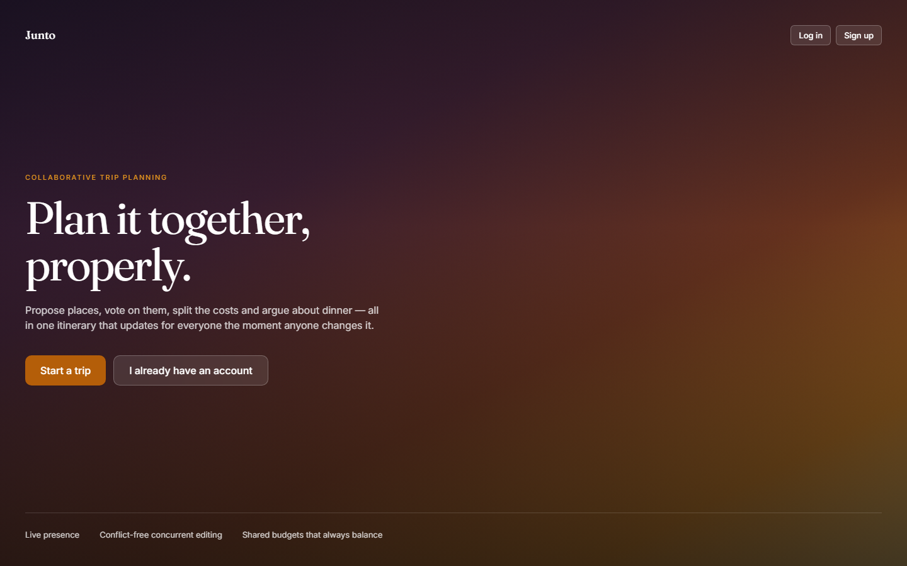
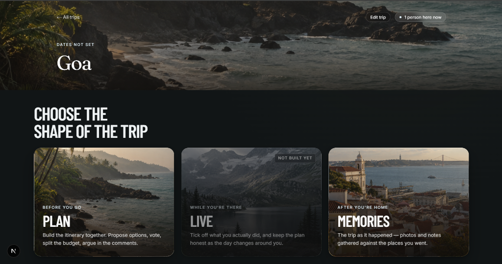
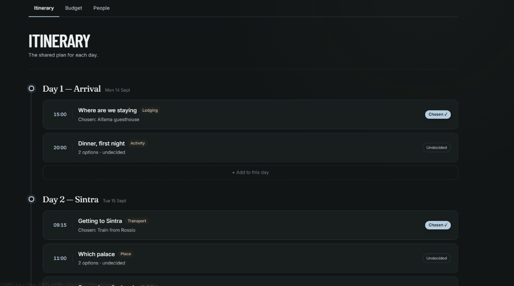
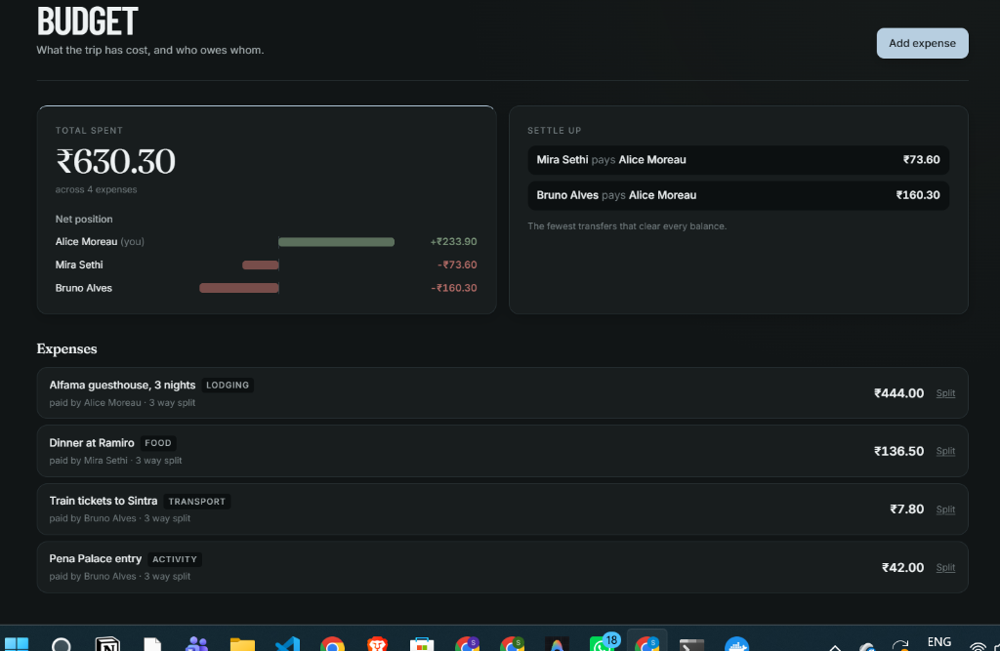
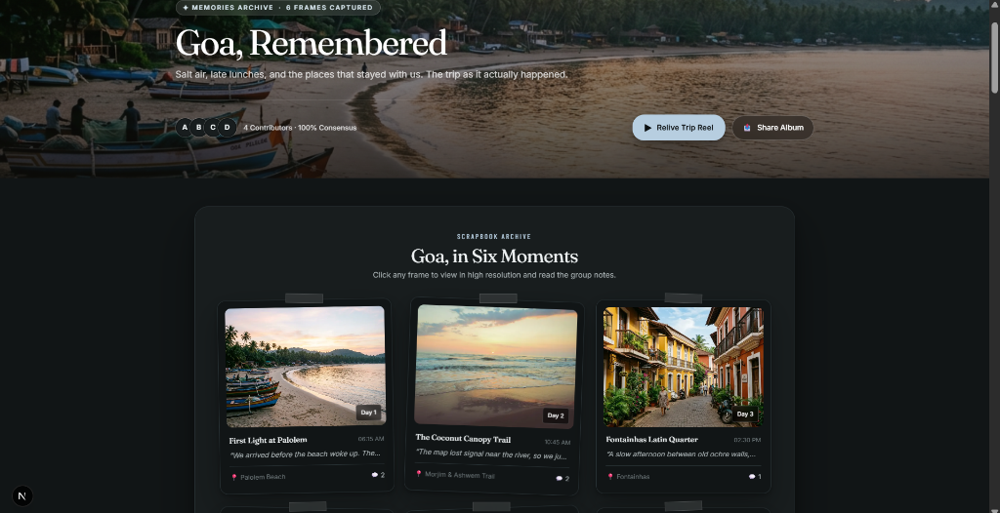
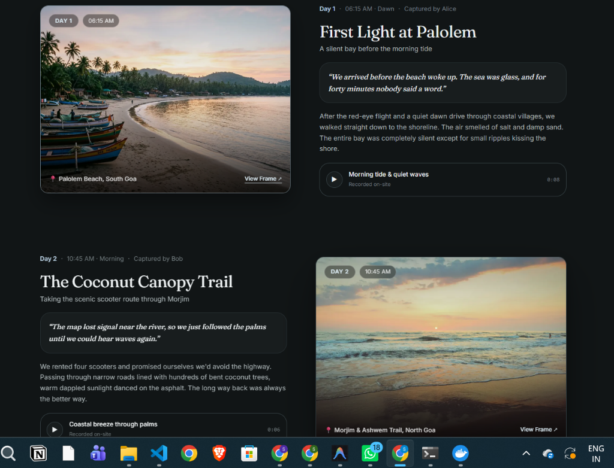

# Junto

**Plan it together, properly.**

Junto is a real-time collaborative trip planning app. Groups propose places, vote on them, split costs, and discuss decisions — all in a shared itinerary that updates for everyone the moment anyone changes it.



---

## Features

- **Trip Hub & Mode Selection** — Clean cinematic entry point with *Plan*, *Live*, and *Memories* modes tailored for every phase of travel.
- **Shared Itinerary** — Organize days, time slots, and activities with real-time status indicators (Chosen, Undecided) and drag-and-drop ordering.
- **Propose & Vote** — Suggest multiple options per slot; the group votes live, and organizers finalize decisions.
- **Live Presence & Real-time Sync** — WebSocket-powered live presence: see who's viewing the trip, watch votes and comments update instantly without reloading.
- **Budget & Expense Split** — Log expenses with multi-person splits, track net creditor/debtor positions, and settle up with minimum transfers.
- **Interactive Memories & Story Chapters** — Relive trips through curated photo scrapbooks, day-by-day narrative chapters, audio ambiance notes, and video story reels.
- **Trip Settings & Management** — Custom cover photo uploads, Unsplash auto-suggestions, trip details editing, and complete trip lifecycle management.
- **Role-based Invitations & Auth** — Secure token invitations, Argon2id password hashing, JWT session management, and granular permission controls.

---

## Screenshots

### Trip Hub & Mode Selector


### Planning & Shared Itinerary
| Itinerary & Decisions | Budget & Cost Split |
|:---:|:---:|
|  |  |

### Memories & Travel Storytelling
| Scrapbook Archive | Journey Story & Photo Chapters |
|:---:|:---:|
|  |  |

---


## Tech Stack

| Layer | Technology |
|---|---|
| **Backend** | Go 1.26, Chi router, pgx (PostgreSQL), Redis pub/sub |
| **Frontend** | Next.js 16, React 19, TypeScript, Tailwind CSS 4 |
| **Database** | PostgreSQL 16 (migrations via golang-migrate) |
| **Real-time** | WebSockets with ticket-based auth, Redis fan-out for multi-instance |
| **Storage** | MinIO / S3 / Cloudflare R2 (presigned uploads) |
| **Auth** | JWT (HS256), Argon2id password hashing, secure session management |
| **Email** | SMTP (Mailpit locally, any provider in production) |
| **Deploy** | Docker (multi-stage scratch image), Render, Vercel |

---

## Quick Start

### Prerequisites

- [Docker](https://docs.docker.com/get-docker/) (for Postgres, Redis, MinIO, Mailpit)
- [Go 1.26+](https://go.dev/dl/)
- [Node.js 20+](https://nodejs.org/)

### 1. Clone & configure

```bash
git clone https://github.com/Sachith77/Junto.git
cd Junto
cp .env.example .env
```

### 2. Start infrastructure

```bash
docker compose up -d
```

This brings up:
| Service | Port |
|---|---|
| PostgreSQL | `localhost:5433` |
| Redis | `localhost:6380` |
| MinIO (S3) | `localhost:9000` (API), `localhost:9001` (console) |
| Mailpit | `localhost:1025` (SMTP), `localhost:8025` (UI) |

### 3. Run database migrations

```bash
go run ./cmd/migrate up
```

### 4. Start the API

```bash
go run ./cmd/api
```

API is now at **http://localhost:8080**

### 5. Start the frontend

```bash
cd web
npm install
npm run dev
```

App is now at **http://localhost:3000**

### 6. Seed demo data (optional)

```bash
cd web
npm run seed
```

This creates three demo accounts and a sample trip with itinerary, votes, comments, and budget entries.

**Demo Accounts:**

| Name | Email | Password |
|---|---|---|
| Alice Moreau | `alice@junto.local` | `correct horse battery staple` |
| Bruno Alves | `bruno@junto.local` | `correct horse battery staple` |
| Mira Sethi | `mira@junto.local` | `correct horse battery staple` |

---

## Project Structure

```
.
├── cmd/
│   ├── api/            # HTTP + WebSocket server entrypoint
│   └── migrate/        # Database migration CLI
├── internal/
│   ├── domain/         # Core types and interfaces
│   ├── service/        # Business logic layer
│   ├── repository/     # PostgreSQL queries (sqlc-generated)
│   ├── transport/
│   │   ├── http/       # REST API handlers (Chi)
│   │   └── ws/         # WebSocket connection management
│   ├── syncengine/     # Real-time operation broadcast & rooms
│   ├── pubsub/         # Redis pub/sub abstraction
│   ├── security/       # JWT, Argon2id, rate limiting
│   ├── email/          # SMTP email sending
│   ├── storage/        # S3/MinIO object storage
│   └── middleware/     # Auth, CORS, request logging
├── migrations/         # SQL migration files (embedded at build)
├── tests/              # Integration tests (testcontainers)
├── web/                # Next.js frontend
│   ├── app/            # App router pages
│   ├── components/     # React components
│   ├── lib/            # API client, WebSocket client, utilities
│   ├── context/        # Auth & sync React contexts
│   └── e2e/            # Playwright end-to-end tests
├── docker-compose.yml  # Local dev infrastructure
├── Dockerfile          # Multi-stage production build (scratch)
└── render.yaml         # Render deployment blueprint
```

---

## Testing

```bash
# Go unit & integration tests
go test ./...

# Go tests with race detector (what CI runs)
go test ./... -race

# Frontend unit tests
cd web && npm test

# End-to-end tests (requires running API + frontend)
cd web && npm run test:e2e
```

---

## Deployment

The API ships as a static Go binary in a `scratch` Docker image. See [`docs/deploy.md`](docs/deploy.md) for the full deployment guide covering Render, secrets configuration, and migration procedures.

---

## License

This project is for educational and portfolio purposes.
