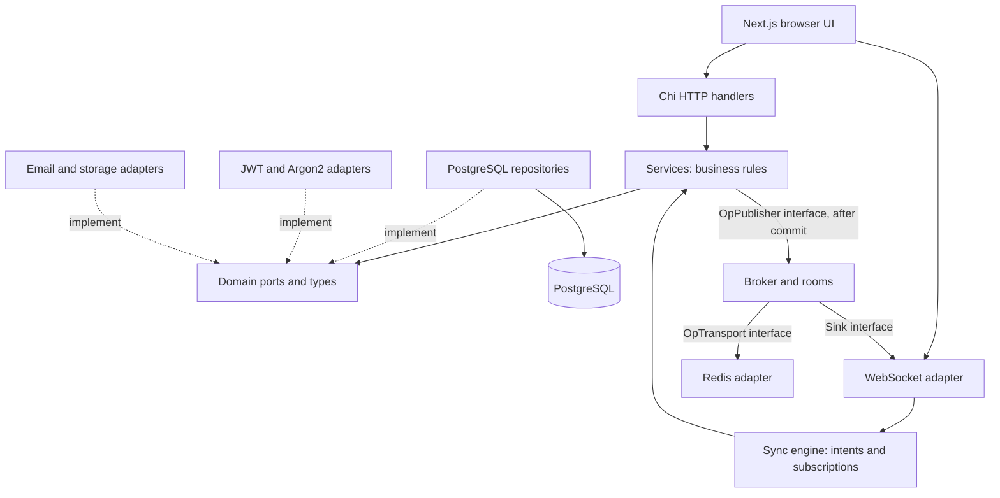
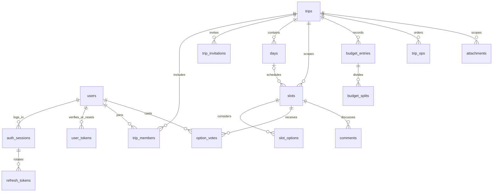
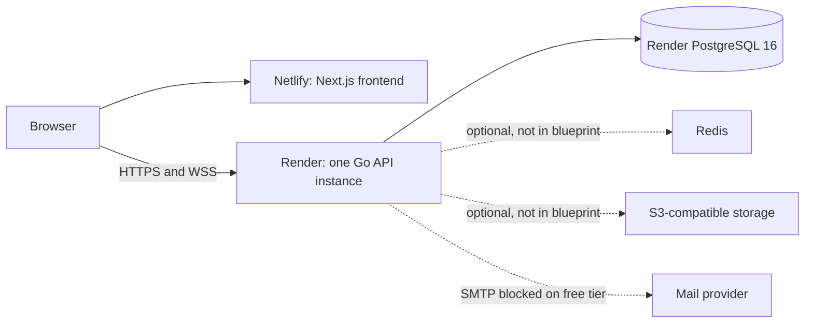

# Junto: interview and engineering review preparation

Prepared from the working tree on **12 September 2026**, based on commit `b204a78` plus the existing, uncommitted frontend changes. This is a study guide and code review, not a claim that the application is production-ready.

The implementation was inspected before this document was written: all five schema migrations; domain models and ports; planning, auth, membership, budget, comment and attachment services; repository transaction and query paths; the sync engine, rooms, replay gate and broker; HTTP/WebSocket transports; security and middleware; frontend socket/auth contexts and important consuming components; deployment files; and representative tests. Generated SQL mappings were considered as adapter output, not as independent architecture.

**Evidence convention:** “Implemented” means visible in this working tree. “Recorded” means described in repository history/comments, without independently reproducing that historical event. “Review finding” means a concrete code observation or reasoned risk; where relevant, a reproduction is still needed. “Proposed” means future work. Code and executable assertions take precedence over comments.

**Verification boundary:** the focused command `go test -short ./internal/domain ./internal/service ./internal/security ./pkg/... ./configs` failed during setup: the installed Go toolchain could not resolve standard-library packages `go/parser` and `testing` under `C:\Program Files\Go\src`. No tests passed in this session. Full Docker integration tests, Playwright, frontend builds, historical benchmarks and live deployment behavior were not rerun. CI configuration is evidence of intended checks, not evidence of a current green CI run.

## How to use this guide

First learn sections 1–5 well enough to explain them without reading. Then trace the files in section 16 while speaking out loud. Use the questions in section 17 as a mock interview. Complete the authorship worksheet in section 18 yourself: source code cannot identify which ideas you personally originated.

Do not memorize explanations you cannot demonstrate. For each important claim, be able to name the invariant, locate its implementation, describe a failure case, and identify the test that would catch that failure.

### Contents

1. [Pitch and safe claims](#1-pitch-and-safe-claims)
2. [Architecture and dependency flow](#2-architecture-and-dependency-flow)
3. [Decision defense](#3-decision-defense)
4. [Database walkthrough](#4-database-walkthrough)
5. [Concurrent editing and synchronization](#5-concurrent-editing-and-synchronization)
6. [Authentication and authorization](#6-authentication-and-authorization)
7. [Budget, voting, comments and attachments](#7-budget-voting-comments-and-attachments)
8. [Frontend behavior](#8-frontend-behavior)
9. [Deployment and operations](#9-deployment-and-operations)
10. [Failure modes and security review](#10-failure-modes-and-security-review)
11. [Limitations and documentation corrections](#11-limitations-and-documentation-corrections)
12. [Performance and scaling](#12-performance-and-scaling)
13. [Testing strategy and evidence](#13-testing-strategy-and-evidence)
14. [What a production team would change](#14-what-a-production-team-would-change)
15. [How to extend the system](#15-how-to-extend-the-system)
16. [Code-reading and demonstration routes](#16-code-reading-and-demonstration-routes)
17. [Hard questions with honest answers](#17-hard-questions-with-honest-answers)
18. [AI assistance and personal ownership](#18-ai-assistance-and-personal-ownership)
19. [Beginner glossary](#19-beginner-glossary)
20. [Study and rehearsal plan](#20-study-and-rehearsal-plan)

## 1. Pitch and safe claims

### One-minute pitch

> Junto is a collaborative trip-planning app. A group can organize an itinerary, suggest alternatives for an activity or hotel, vote, discuss decisions, and split expenses. The useful product distinction is that a scheduled decision and its candidate options are separate, so people can disagree without creating competing itineraries.
>
> The engineering focus is keeping collaborators consistent when they edit concurrently or reconnect. The Go backend stores data in PostgreSQL and records supported planning changes in the same transaction as an ordered operation log. WebSockets deliver updates, and Redis can distribute them between API instances. Different-field edits can both survive; same-field edits use server-ordered last-writer-wins. Budget changes use a stricter whole-entry version check.
>
> This is a server-authoritative system, not Google Docs-style text merging or a fully offline app. The demo uses a small single-instance deployment. I used AI assistance, and I’m prepared to explain the implementation, its tests, and the limitations I would address before production.

Replace the last sentence with wording that matches your actual experience. Do not say you have mastered the code until you have completed the exercises.

### Five-minute deep dive

**Minute 1 — problem and product model.**

“Trip planning mixes scheduling with group decisions. A spreadsheet can hold a schedule, but it does not naturally model ‘we need a hotel here; these are three candidates; everyone has one current preference; we selected this candidate because it was available.’ Junto separates `slots` from `slot_options`. A slot holds the schedule and final selection; an option holds its own place and estimate. Voting informs the decision without automatically determining it. Days can be undated, and slots can be unscheduled, because planning starts before every detail is known.”

**Minute 2 — implementation structure.**

“The backend is a modular Go application with Chi REST handlers and a WebSocket adapter. Domain types and interfaces live in `internal/domain`. Services enforce business rules through those interfaces. PostgreSQL repositories use handwritten SQL compiled into typed Go methods by sqlc, with pgx as the driver. `cmd/api` connects these pieces by constructor injection. Import tests guard dependency direction. This lets REST and socket writes share the same mutation logic instead of maintaining two implementations.”

**Minute 3 — consistency model.**

“Each logged planning write first locks the trip row in a transaction. It then reads the current entity, applies the requested fields, persists the result, allocates one or more per-trip sequence numbers, and appends resolved effects to `trip_ops`. Commit makes state and history durable together. If two clients change different fields without stale-version preconditions, both changes survive. If they set the same field, the later sequence wins. The cost is deliberate: writers to one trip serialize. Different trips can progress independently.”

**Minute 4 — delivery and failure recovery.**

“After commit, the broker sends updates to local sockets and optionally Redis peers. Those sends can be lost or arrive out of order. Rooms restore sequence order, fill gaps from PostgreSQL, and periodically check the durable head to detect a lost final message. On reconnect, clients can ask for operations after their last sequence. A gate buffers live events during replay. The server’s reference replica ignores duplicates and rejects gaps. The browser uses the same event channel but often refetches REST data, so I distinguish protocol tests from browser correctness.”

**Minute 5 — trade-offs, evidence and next work.**

“Budget entries are replaced together with their split sets, with version checks and a deferred database sum constraint. Auth uses Argon2id, short-lived JWT access tokens, and rotating opaque refresh tokens tied to sessions. Integration tests cover concurrent edits, replay, shared tickets and two API instances. The demo is Render plus a Netlify frontend, despite stale Vercel references. Before production, I would address permission revocation on existing subscriptions, cookie topology, complete schema readiness checks, browser recovery races and currency consistency. I would also add reliable email delivery, operational monitoring, cleanup scheduling and frontend CI.”

### Claims to say precisely

| Avoid saying | Say instead |
|---|---|
| “It is a distributed CRDT like Google Docs.” | “It uses field-level LWW semantics under a PostgreSQL per-trip total order. It is server-authoritative and does not merge characters.” |
| “All writes are event-sourced.” | “Supported itinerary, vote, budget, comment and visible attachment changes are logged transactionally. Identity, trip metadata and membership are not reconstructed by this log.” |
| “Redis guarantees delivery.” | “PostgreSQL holds the durable log; Redis accelerates fan-out.” |
| “We have exactly-once WebSockets.” | “The protocol permits duplicates and supports idempotent submission by client operation ID.” |
| “JWT auth is stateless.” | “Access tokens are signed JWTs, but authenticated HTTP requests also check session state in PostgreSQL.” |
| “The DB guarantees exactly one owner.” | “A partial unique index guarantees at most one active owner; trip creation inserts its owner transactionally.” |
| “The live site proves horizontal scaling.” | “There is a two-instance integration test; the deployment configuration is single-instance.” |
| “The whole frontend folds the log.” | “The Go reference replica does; browser components use a mix of event handling and REST refetches.” |
| “It finds the minimum number of payments.” | “The UI computes a greedy settlement suggestion; there is no proof of a global minimum.” |
| “The project has 75% verified coverage.” | “CI has a 75% coverage gate. A current passing coverage report must be checked separately.” |

## 2. Architecture and dependency flow

Sources: [ports](../internal/domain/ports.go), [composition root](../cmd/api/main.go), [architecture tests](../tests/arch_test.go), [domain import test](../internal/domain/arch_test.go).



Solid arrows here show calls/data flow; dotted arrows show interface implementation. A runtime service call reaches a repository object, but the service’s source code imports the **interface**, not the concrete repository package. That distinction is dependency inversion.

There is no separate top-level `ports/` directory. Most ports are in `internal/domain/ports.go`; revocation interfaces are in `internal/domain/revocation.go`. Narrow local interfaces also exist: `syncengine.Sink`, `OpReader`, `SeqReader`, and the WebSocket `TicketStore`.

| Area | What it owns | What it should not own |
|---|---|---|
| `domain` | IDs, entities, validation, capabilities, operation vocabulary, reference replica, interfaces | HTTP codes, SQL driver types, sockets |
| `service` | Use cases, permission checks, transactions through a port, mutation recording | SQL text, WebSocket frames |
| `repository` | SQL execution, persistence mapping, constraint error translation | Product permissions, HTTP responses |
| `syncengine` | Intent dispatch, room lifecycle, presence, replay and ordered delivery | Network-library types or direct mutation SQL |
| `transport/http` | Route parsing, DTO conversion, calling services, status/error rendering | Direct repository writes |
| `transport/ws` | Handshake tickets, frames, connection pumps, buffering, socket revocation | Independent business mutation rules |
| `pubsub` | Redis connection and message encoding for operations/revocations | Durability authority |
| `security`, `email`, `storage` | Implement infrastructure ports | Business workflow orchestration |
| `cmd/api`, `configs` | Wiring, lifecycle, environmental settings | Reusable business logic |
| `web` | Views, form state, HTTP/socket clients, browser session restoration | Trusted permission enforcement |

**Why the broker and engine are separate:** services need a publisher, while the engine needs the services. Constructing broker → services → engine avoids a constructor cycle. This is a practical reason for the split, not just a diagram preference.

**What “transport-agnostic” actually buys:** another delivery adapter can implement `Sink`; the core does not import a WebSocket library. It does not mean replacing WebSockets with SSE requires zero work: browser submission, authentication and connection behavior would still change. It also does not mean domain-agnostic: dispatch names trip-specific services and operation kinds.

## 3. Decision defense

The reasoning below is either recorded in `CLAUDE.md` and corroborated by code, or a defensible technical explanation of the present implementation. Neither proves who originally made the decision.

### 3.1 Go, Chi and a separate Next.js frontend

Go fits a long-running server that manages many network connections: goroutines, channels, context cancellation and a static deployment binary are useful here. Chi composes routing with standard `net/http` middleware. Next.js/React provides page routing and component-based UI.

**Alternative:** an all-TypeScript backend would reduce language/context switching and make sharing wire types easier. It could serve the product perfectly well. Go adds a separate build/toolchain and duplicated wire types, so do not argue it was the only viable language. The reason to defend it is the server’s concurrency and explicit architecture, not a claim that Node cannot do real-time work.

**Alternative:** a smaller React SPA could also meet the current frontend’s needs. Much of Junto is client-side authenticated state; do not claim extensive server-rendering optimization merely because Next.js is installed.

### 3.2 PostgreSQL rather than a document database or Redis as the database

The problem is highly relational: members belong to trips; options belong to slots; a vote must target an option in the correct slot; splits belong to an entry; a selected option must belong to that same decision. PostgreSQL lets constraints and transactions enforce these relationships alongside the operation log.

A document database could store a whole trip together, but growing arrays, concurrent partial edits and relationships across identities would require a different consistency design. It is not inherently incapable; it simply offers less direct benefit for this schema. Redis alone would require rebuilding durable transactional relationships that PostgreSQL already handles.

SQLite would be attractive for a small single-process app, but the present design targets multiple API instances sharing a database and relies on PostgreSQL locking and constraint features. PostgreSQL is the central write authority, so losing connectivity to it stops authoritative writes.

### 3.3 pgx + sqlc rather than an ORM

Handwritten SQL makes lock order, composite keys, partial indexes, `RETURNING`, conditional updates and deferred constraints visible. sqlc generates typed query methods from SQL; pgx executes them. The repository then maps generated rows to domain objects.

An ORM could reduce ordinary CRUD boilerplate and improve relation navigation. It would not eliminate custom SQL for this project’s difficult queries. The current approach trades more mapping code and a generation workflow for explicit database behavior. It is not automatically faster just because it is not an ORM: performance still depends on the query and indexes.

Generated code is committed; CI deletes the output directory, regenerates, and checks the diff. Deletion matters because a removed query file can otherwise leave a stale generated Go file behind. Source: [sqlc configuration](../sqlc.yaml), [CI](../.github/workflows/ci.yml).

### 3.4 Layers and ports rather than handlers containing SQL

REST and WebSocket writes must share validation, permission rules and recording. Placing those in services prevents transport-specific drift. Fakes can exercise business behavior without a database, while repository tests exercise actual SQL.

The price is constructor wiring, DTO conversion and more files. A smaller CRUD-only application might reasonably use fewer layers. Here the two mutation transports and shared log make the separation useful. Import tests enforce specific forbidden dependencies; they do not prove the absence of every misplaced business rule.

### 3.5 A modular application rather than microservices

The API, auth, planning services and socket adapter ship together. That simplifies the most important transaction: update planning state and append its effects atomically. Splitting the log writer, budget and itinerary into independent services would introduce distributed coordination and operational costs.

Horizontal replication of the existing application is different from decomposing it into microservices. Extract a component only when separate ownership, resource usage or reliability demands it; file count is not a reason.

### 3.6 Server-ordered field assignments rather than OT or a local-first CRDT

For scalar fields such as `title`, an edit is “set this field to this value.” Concurrent different-field assignments can both survive. Concurrent assignments to the same field require a winner; Junto uses the server’s per-trip sequence.

Operational transformation is particularly relevant to index-relative edits such as inserting text at character 12. Junto does not perform those operations, and fractional indexing avoids expressing itinerary moves as “shift every position after index 12.” Implementing OT here would add machinery without supplying a needed character-editing experience.

A mature local-first CRDT library could support independent offline edits and later reconciliation, including rich text. That would require persistent client state, causal metadata, richer tombstone and authorization semantics, and different handling of money. Junto instead chooses one online authority.

**The terminology trap:** the repository labels this CRDT/LWW. The actual `Replica.Apply` requires an ordered stream and stores no independent per-field timestamp comparison that accepts arbitrary reordering. Explain the mechanism as “server-sequenced field-level LWW replication.” If someone reserves “CRDT” for independently mergeable replicas, acknowledge the narrower implementation rather than arguing that passing a convergence test establishes every CRDT property.

### 3.7 Trip row locking rather than only entity versions or in-process mutexes

An in-process mutex cannot coordinate two API instances. An entity-version check alone prevents overwrites but rejects both same-field and different-field stale edits alike. Taking the trip lock before reading lets the second writer see the first writer’s committed changes before applying its own mask.

The lock covers a room’s ordered changes and multi-entity effects. Its cost is a per-trip throughput ceiling and waiting even when two writes affect independent entities in that trip. Locks to different trips can proceed independently. PostgreSQL documents that row locks block conflicting writers, while ordinary reads can still proceed. [PostgreSQL row locks](https://www.postgresql.org/docs/16/explicit-locking.html).

**Actual SQL differs from older prose:** `LockTripForWrite` first uses `SELECT ... FOR UPDATE`; later `NextTripOpSeq` increments the counter for each effect. Do not repeat the old claim that incrementing `op_seq` is literally the first statement. Source: [ops.sql](../internal/repository/queries/ops.sql).

### 3.8 Transactional counter rather than a PostgreSQL sequence or timestamp

`trips.op_seq` rolls back with the mutation. A PostgreSQL sequence normally does not reclaim a number after a failed transaction, so gaps would no longer reliably signal a missed operation. Wall-clock timestamps are also weaker ordering identifiers: clocks can disagree, and multiple events can share a timestamp. [PostgreSQL sequence behavior](https://www.postgresql.org/docs/16/functions-sequence.html).

The counter is per trip, not global. Two trips can both have sequence 42 without conflict. Sequence and entity `version` serve different purposes: sequence orders the room’s history; version is a precondition on one row.

### 3.9 Resolved effects rather than replaying intentions

A move request may say “after slot A.” The stored effect contains the computed `position`, not that request. Recomputing the position during replay could give a different result because A’s neighbors changed.

Deleting a selected option produces both an option tombstone and a slot-selection clearing effect. Clients replay the effects rather than independently implementing the cascade. `cause_op_id` groups them; only the first carries `client_op_id` because that field is unique per trip when non-null.

### 3.10 State tables plus a log rather than a full event-sourced application

Current state is easy to query through normal tables. The supported log projection can reconstruct planning entities for synchronization tests and replay. This is a useful hybrid.

It is not a complete event-sourced identity/product model. Trip metadata, invitations and membership changes are absent from the operation vocabulary; pending uploads are also outside the visible projection. Nor is the log cryptographically tamper-proof. There is no database privilege/trigger scheme here that makes arbitrary administrative edits impossible.

### 3.11 WebSockets rather than polling or SSE

WebSockets support a persistent bidirectional channel for edits, committed events and presence. Polling would repeatedly request state, trading simplicity for latency and redundant requests. SSE plus REST is a serious alternative: server events are one-way, but writes can remain HTTP. It could satisfy much of the current UI, which already uses REST for many actions.

The cost of WebSockets is explicit reconnect, authentication, queue bounds, heartbeat, load-balancer support and revocation handling. Junto pays that cost in `transport/ws` and `web/lib/socket.ts`.

### 3.12 Redis Pub/Sub rather than Redis Streams, Kafka or database notifications

The authoritative log already lives in PostgreSQL, so Redis only needs to tell other instances promptly about committed operations. Pub/Sub is lightweight and supports per-trip channels. It does not retain messages for offline subscribers; its delivery is at-most-once. [Redis Pub/Sub semantics](https://redis.io/docs/latest/develop/interact/pubsub/).

Redis Streams or Kafka would provide a durable messaging layer and useful consumer coordination, but introduce another retention/ordering system. PostgreSQL `LISTEN/NOTIFY` could reduce infrastructure count, but would couple fan-out more tightly to database connections and still need replay. The present design is reasonable for a portfolio-sized collaborative workload, with a clear dependency on database repair.

### 3.13 Publish after commit rather than inside the transaction

Publishing inside a transaction can announce an edit that later rolls back. Publishing after commit leaves a crash window in which a real edit is not announced, but that edit can be recovered from the log.

This is not a complete transactional-outbox worker. It is transactional recording plus best-effort publication and reader repair. Also, `Broker.Publish` calls peer publication synchronously with a timeout: committed data is independent of Redis delivery, but response latency can still increase during a Redis problem.

### 3.14 Fractional string ordering rather than dense integers, floats or linked lists

`pkg/fracdex` computes a key between neighbors. A move generally changes one row instead of renumbering a suffix of the itinerary. String keys avoid floating-point midpoint precision exhaustion. A linked list would complicate sorted reads and concurrent pointer updates.

Ordering uses `(position, id)` and database `COLLATE "C"` for predictable byte ordering. The algorithm explicitly credits David Greenspan’s fractional-indexing work; do not claim invention. Keys can grow; the domain/schema limit is 128 characters and no rebalance job is implemented. A tie-breaker orders equal keys, but does not magically produce a key between two equal strings.

### 3.15 UUIDs rather than database-only integer IDs

Application-generated UUIDs allow a client to name an entity before persistence and avoid coordinating an integer allocator across application instances. Backend `NewID` uses UUIDv7, which has a time component and generally better insertion locality than fully random IDs.

Nuance: migrations still have `DEFAULT gen_random_uuid()` safety nets, and browser `crypto.randomUUID()` is not UUIDv7. Client-provided IDs are parsed as UUIDs without a universal v7 requirement. Therefore “every ID is v7” is false. UUIDs are identifiers, not permission checks, and use more space than small integers.

### 3.16 Tombstones rather than immediate physical deletion

`deleted_at` preserves a row’s existence for history and concurrent ordering. A late edit after deletion generally gets not-found; an edit committed before deletion remains in history. Tombstones do not provide an implemented undo interface or automatic resurrection.

Soft deletion also does not execute `ON DELETE` foreign-key actions. Each business cascade must be implemented separately or represented in read semantics. This is a significant cost, not merely an aesthetic convention.

### 3.17 Normalized ownership and relationships rather than duplicate facts

The owner is a membership role, not both `trips.owner_id` and a membership row. `selected_option_id` is stored independently of votes because selection is a deliberate decision. Denormalized `trip_id` on child rows speeds authorization/scoping; composite foreign keys constrain it to agree with the parent.

For attachments, three optional owner columns plus `num_nonnulls(...) = 1` are used instead of `(owner_type, owner_id)`. This preserves real foreign keys. However, attachment owner FKs are individual IDs, not composite trip-scoped keys; owner/trip agreement remains a service check there.

### 3.18 Local schedule values rather than converting everything to UTC

A trip has an IANA zone, a day has a date, and a slot has a local `TimeOfDay`. Moving the trip dates should not turn breakfast into a different wall-clock hour. Audit timestamps and token expiry are instants; scheduled local times are a different concept.

This does not solve every time problem: nonexistent/repeated times around daylight-saving transitions need a product policy, and `end_time >= start_time` prevents a single slot from naturally expressing an overnight interval. No flight itinerary with multiple endpoint zones is modeled.

### 3.19 Integer money and atomic split sets

Amounts are `int64`/`bigint` minor units. Splits store explicit amounts, not percentages, so remainders have a definite owner. The entry and complete split set are replaced together. An edit requires a version; a stale edit is rejected.

An alternative is database decimal arithmetic, especially for exchange rates or quantities requiring different precision. It would not remove the need for a currency policy or exact split allocation. Field-level merging is inappropriate when individually valid fields can form an invalid total together.

### 3.20 Authentication choices

Argon2id is a memory-hard password hashing function. SHA-256 is fast and therefore inappropriate for human-chosen passwords; bcrypt remains a legitimate established alternative. Junto stores parameters and salt with each Argon2 hash and can rehash after a successful login. The configured default is 64 MiB, three iterations, parallelism four; describe this as the project’s configuration, not a verbatim current OWASP profile. [OWASP password storage guidance](https://cheatsheetseries.owasp.org/cheatsheets/Password_Storage_Cheat_Sheet.html).

Refresh tokens are high-entropy random secrets, so SHA-256 storage is appropriate for lookup without paying password-hash costs. HS256 access JWTs are simple for one trust domain; asymmetric signing would better separate token signing from verification across multiple independently trusted services. A plain opaque session cookie would also be defensible because HTTP already checks the session database. JWTs here should not be sold as eliminating database reads.

### 3.21 Operational choices

Configuration comes from environment variables and is validated at boot. Explicit constructor injection makes topology visible. JSON logs and request IDs make failures correlatable. A non-root static binary in `scratch` is small and contains fewer runtime tools, but debugging it is harder than debugging a full Linux image.

Embedded migrations travel with the binary; applying them is still a separate operational step. Keyset pagination avoids increasingly expensive offsets and reduces shifting-page behavior, but does not turn multiple requests into a consistent snapshot.

## 4. Database walkthrough

Read [identity migration](../migrations/000001_identity.up.sql), [trip migration](../migrations/000002_trips.up.sql), [budget/attachments migration](../migrations/000003_budget_attachments.up.sql), [sync migration](../migrations/000004_sync.up.sql), and [comments migration](../migrations/000005_comments.up.sql).

### Relationships at a glance



The diagram omits some cross-links for readability: a selected option belongs to its slot; a vote optionally points to an option in its slot; a budget entry optionally points to an option in its trip; an attachment has exactly one slot, option or budget owner.

### Identity tables

**`users`:** account ID, email, password hash, display name, verification timestamp, version and lifecycle timestamps. `lower(email)` is unique among non-deleted users. This avoids an extension just for case-insensitive account identity. The service normalizes email to lowercase despite comments that say original casing is retained.

**`auth_sessions`:** one login/device family, not one HTTP request. It stores user, user-agent, IP, creation/usage/expiry timestamps and revocation details. A family provides a single place to invalidate every refresh token descended from that login.

**`refresh_tokens`:** token hash, session ID, expiry, `used_at` and `replaced_by`. Keeping consumed tokens lets the server distinguish an unknown token from a replay of a previously valid token. The stored hash is 32 bytes. Raw tokens must not be persisted in this table.

**`user_tokens`:** verification and password-reset secrets share a lifecycle and use a `purpose` discriminator. A hash, expiry and consumption time enforce a one-shot credential. These credential tables do not use the same soft-delete/version convention as editable product entities.

### Trip and planning tables

**`trips`:** name, description, nullable start/end dates, zone, version and deletion timestamps; later migrations add `base_currency` and `op_seq`. Dates may be unknown. `op_seq` starts at zero. Currency defaults to `USD`, but is not wired through the full domain/API/frontend path.

**`trip_members`:** trip/user association and role. The active `(trip_id,user_id)` pair is unique. The active owner index prevents two owners, but a unique index cannot require that an owner exists. Creation inserts trip and owner atomically; general role editing/removal protects the existing owner.

**`trip_invitations`:** trip, optional target email, role, hashed secret, creator, expiry, maximum uses, actual uses and revocation timestamp. A null email means a shareable bearer link. Roles exclude owner. The conditional use-count update enforces expiry/revocation/capacity at redemption time.

**`days`:** trip, optional date, label, position, version and tombstone. A partial unique index prevents duplicate active dates within a trip while allowing undated planning days. `(id,trip_id)` is unique so slots can reference the pair.

**`slots`:** the addressable decision. Holds title, kind, notes, optional day, local times, fractional position, chosen option, execution status and attribution. A slot with no day is backlog. A slot may be unresolved yet still occupy time in the itinerary.

**`slot_options`:** candidates under a slot, with separate title, notes, URL, cost estimate, place fields and proposer. Composite FKs prohibit claiming a trip different from the parent slot’s trip. Coordinates are both absent or both present; latitude and longitude have range checks.

**`option_votes`:** one current preference per `(slot_id,user_id)`. `option_id = NULL` means withdrawn. The option/slot composite FK prevents voting for an option in a different decision. A vote’s user ID comes from the authenticated actor, not a trusted client field. Votes do not automatically update `selected_option_id`.

**`comments`:** flat chronological messages on slots, body length 1–4000, nullable author, timestamps and tombstone. There is no parent-comment column and no edit method. The migration title mentions “threaded discussion,” but the implemented structure is flat. Only the author can delete, with the additional current comment-capability requirement.

### Ledger, files and synchronization tables

**`budget_entries`:** trip, optional option link, label/category, integer total, optional payer/date, creator, version and tombstone.

**`budget_splits`:** one explicit amount for each named user on an entry, unique by `(budget_entry_id,user_id)`. Zero splits is a legal “not yet split” state. If splits exist, their total must match the entry amount. Deferred triggers check both split changes and entry-total changes at transaction end.

**`attachments`:** a file or link; exactly one of three owner references; pending/ready/failed status; storage key or external URL; metadata; uploader and lifecycle timestamps. A file has a storage key; a link has a URL and is immediately ready. There is no version because ready metadata has no edit use case.

**`trip_ops`:** server operation ID, trip, sequence, actor, versioned operation kind, entity ID, explicit fields, JSONB payload, client/cause IDs and timestamp. `(trip_id,seq)` is unique. Non-null client operation IDs are unique per trip. The payload is polymorphic append-only data, a good use of JSONB; editable place data remains explicit columns.

`entity_id` is not a foreign key to every possible entity table. The log intentionally spans entity types. The migration’s “immutable” claim is an application convention backed by query discipline, not an SQL prohibition on update/delete. The extra `(trip_id,seq)` index duplicates the access shape already supported by the unique constraint’s index and deserves a write-cost review.

### Explain three constraints at the whiteboard

1. **Cross-trip day reference:** `(slot.day_id, slot.trip_id)` must match `(day.id, day.trip_id)`. A real day from another trip is still invalid. On a *hard* day deletion, only `day_id` is set null; the non-null trip ID survives.
2. **Selected option belongs to this slot:** `(selected_option_id, slot.id)` references `(option.id, option.slot_id)`. This is stronger than merely checking that the option exists.
3. **Budget sum:** a transaction may temporarily delete old splits before inserting replacements. Immediate checks would reject intermediate states; deferred checks assess the intended final state. The repository refuses to run `Save` outside a transaction, because a crash between independently committed statements could leave a legal but unintended unsplit entry.

The database validates stored shapes; services enforce actor permissions and live-resource rules. Foreign keys generally do not know that a row with `deleted_at` is unavailable.

## 5. Concurrent editing and synchronization

Sources: [service recording](../internal/service/oplog.go), [slot service](../internal/service/slot.go), [engine](../internal/syncengine/engine.go), [broker](../internal/syncengine/broker.go), [room dispatcher](../internal/syncengine/room.go), [reference replica](../internal/domain/op.go).

### 5.1 A complete two-person example

Assume Alice and Bruno are editors in trip T. Both have authenticated sockets subscribed to T. They see slot S with `title="Hotel"`, `notes="Near station"`, `version=7`; the trip is at sequence 40.

Alice’s logical request is:

```json
{
  "type": "op",
  "trip_id": "<trip UUID>",
  "client_op_id": "<Alice's new operation UUID>",
  "kind": "slot.edit.v1",
  "entity_id": "<slot UUID>",
  "fields": ["title"],
  "values": {"title": "Hotel near beach"}
}
```

Bruno sends the same kind with `fields:["notes"]` and `values:{"notes":"Maximum 8000 per night"}`. These are illustrative frames: replace the placeholders with valid UUIDs. Neither sends a `values.version` precondition.

1. The socket adapter identifies each actor from the redeemed ticket, validates IDs and confirms subscription.
2. `Engine.Submit` checks the operation kind and client operation ID, looks for a prior committed operation with that ID, and dispatches to `SlotService.Update`.
3. The service checks `CapEditSlots`, validates the field mask, and enters `oplog.write`.
4. Suppose Alice acquires the trip row lock first. Bruno waits at the same lock even if connected to another API instance.
5. Alice reads S at version 7, changes only title, validates the resulting slot, and updates it to version 8. Unnamed fields are copied from the current row, not from her stale browser object.
6. The recorder allocates sequence 41, creates a payload from the persisted result, and appends it in the same transaction.
7. Commit releases the lock. Bruno then reads version 8, which already contains Alice’s title. He changes only notes, producing version 9 and sequence 42, and commits.
8. Each service publishes after commit. Rooms send operations to subscribed clients, including the author. The author’s echoed `client_op_id` resolves its acknowledgement.
9. Reference clients apply 41 then 42. Both end with Alice’s title and Bruno’s notes. The database and folded log agree for those fields.

The important fact is **read after taking the shared database lock**. If both transactions read version 7 before locking, the second full SQL update could replace Alice’s title with the stale title it read earlier.

### 5.2 Same field: what wins and what is lost?

If both change notes, the transaction assigned the later sequence determines visible notes. Both successful effects remain in the log. “Last” means server serialization order, not when the user typed, clicked, or generated a UUID. The winning user is not predetermined.

This is convergence, not preservation of every user’s intention. Two paragraphs are not combined. The log retains the earlier value for possible audit tooling, but there is no automatic user-facing conflict-history or undo feature.

If both supply `version=7`, only the first update can succeed; the second encounters a version conflict. **Merge versus stale-write rejection is a property of the request**, not strictly “REST versus WebSocket.” Ordinary REST edits without a mask can also replace all editable fields, which is much coarser than a single-field collaborative edit.

### 5.3 Other races to explain

| Race | Actual behavior/contract |
|---|---|
| Two users create different options | Different entity IDs allow both candidates to exist, ordered by committed effects. |
| One user votes from two devices | Upsert preserves one row for that user/slot; later accepted set wins. |
| Different users vote | Separate rows; both preferences count. |
| Edit then delete | Both may commit; final row is tombstoned. |
| Delete then edit | A subsequent service read excludes the tombstone; edit can fail not-found. Do not promise both always succeed. |
| Delete selected option | One transaction records option deletion and clearing the slot’s selection; no alternate candidate is promoted. |
| Two budget edits based on the same version | One succeeds and one conflicts; no merging of split sets. |
| Two uploads | Both can exist; bytes are not merged. |
| Two moves of one slot | Later accepted position/day assignment wins unless a version precondition rejects it. |
| Invalid combined time fields | Validation still applies; field-level merging does not override `end >= start`. |

The delete/edit test’s introductory comment is too strong: its executable body explicitly permits a rejected edit when deletion wins first. Quote the behavior, not the comment.

### 5.4 Delivery order is a separate problem from commit order

Even locally, sequence 42’s goroutine can reach `Publish` before sequence 41’s goroutine after their commits. Across instances, Redis publishers add more possible reordering.

A room’s dispatcher tracks the next expected sequence and holds later operations in a pending map. It waits about 150 ms for a missing predecessor, then reads from `trip_ops`. It also checks `trips.op_seq` about every five seconds so that a lost *last* message can be detected even if no later sequence reveals a gap.

The room inbox holds 512 operations; a connection’s send queue holds 256 frames. A slow subscriber should be dropped/resynced instead of blocking every other viewer. These are item-count bounds, not a comprehensive byte-memory or connection-admission budget. The pending reorder map has no explicit size cap.

### 5.5 Reconnect and replay

The browser obtains a new ticket for a new connection and remembers per-trip sequence in memory. A subscription can express:

- `since_seq` omitted/null: establish a baseline at the current head; the client must acquire current state separately.
- `since_seq: 0`: replay from the beginning.
- `since_seq: N`: replay after N.
- Negative N: validation failure.
- N ahead of the database, or backlog beyond the configured replay maximum: `resync_required`.

Default replay pages are 1000 operations; the default replay ceiling is 10,000. Replay joins the room behind a gate before scanning the log, preventing a read-then-join hole. The transport first announces `subscribed`, then invokes the replay closure. Live events wait in the gate, which has a 1024-event limit.

Replay and buffered live delivery can overlap. The Go reference replica ignores `seq <= current`, accepts the next sequence, and rejects a gap. This is why duplicates are expected and safe **for that replica**. The browser does not implement the same sequence guard; see section 8.

### 5.6 Lost acknowledgement and idempotency

If an operation committed but its acknowledgement was lost, a capable client retries the **same** `client_op_id`. The server can return the already-committed first effect without mutating again. A unique database index protects the duplicate-append race, beyond the initial lookup optimization.

Limits worth knowing:

- The current browser does not persist and automatically resend pending intents; its `sendOp` creates a new ID and times out after eight seconds.
- A manual retry that creates a new ID is a new intent, not an idempotent retry.
- Only the first effect is returned by `replayed`; later cascade effects are recovered through ordinary delivery/replay.
- Dedupe lookup does not bind the key to the same actor or compare request contents. UUID unpredictability is not a replacement for deliberate replay authorization.
- Some simultaneous retries of destructive operations could encounter not-found before reaching the append uniqueness check. “Every possible retry race returns a successful cached acknowledgement” needs more tests than the common replay case.

### 5.7 What the consistency guarantee does not cover

The application does not accept partitioned writes without PostgreSQL. A set of REST reads is not an atomic snapshot tied to a sequence. The operation log does not cover the entire product. Multi-effect transactions are atomic in PostgreSQL, but individual frames can be observed separately by clients. Consistency means the supported projection converges after successful delivery/replay; it does not mean every transient browser frame is a complete database transaction.

## 6. Authentication and authorization

Sources: [auth service](../internal/service/auth.go), [auth handlers](../internal/transport/http/auth_handler.go), [JWT adapter](../internal/security/jwt.go), [Argon2 adapter](../internal/security/argon2.go), [browser auth](../web/context/AuthContext.tsx).

### 6.1 Normal signup, verification and login

1. `POST /api/v1/auth/signup` decodes email, password and display name. Domain checks require a password of at least 12 Unicode characters and at most 1024 bytes. There is no mandatory uppercase/symbol rule.
2. The service hashes the password with a random salt and Argon2id. It normalizes email, creates a UUID, and transactionally stores the user and a hashed email-verification token.
3. After commit, SMTP sends a link to `/verify-email?token=...` on the frontend. The normal signup response contains the user, not a login session.
4. The verification page submits the secret to `POST /auth/verify-email`. The service checks purpose, expiry and prior consumption, consumes it, and marks the account verified within a transaction.
5. `POST /auth/login` looks up the account and verifies the password. Unknown accounts incur a dummy hash verification so that the cheap not-found path does not trivially reveal registration by timing.
6. An unverified account is rejected after successful password verification. Other credential failures are generally opaque 401 responses; email-not-verified is a distinct 403 for usability.
7. On successful login, the service creates a session and refresh-token hash together. It returns an HS256 access JWT in JSON and sets the raw refresh secret in a cookie.

Default lifetimes in configuration: access 15 minutes, refresh 30 days, absolute session 90 days, verification 24 hours, password reset one hour. Refresh expiry moves forward when rotated; session expiry remains an independent absolute upper bound.

**Demo exception:** `render.yaml` explicitly sets both `AUTH_AUTO_VERIFY_EMAIL` and `AUTH_ALLOW_AUTO_VERIFY_IN_PRODUCTION`. That branch immediately sets the verification timestamp and creates no verification token or email. It still does not itself create a session. The frontend can recognize the returned verified timestamp and guide the user accordingly. Never describe this demo as proving email ownership.

### 6.2 What is in the two credentials?

The access JWT includes subject/user ID, issuer, issue/expiry/not-before times, a JWT ID and `sid` for session ID. The parser restricts HS256, checks issuer and times, and requires issue/expiry fields. A signature protects integrity, not secrecy; JWT payloads are not encrypted.

The refresh token is an opaque random secret from `pkg/secrets`. PostgreSQL stores only its SHA-256 hash. It is sent as `junto_refresh`, `HttpOnly`, `SameSite=Lax`, path `/api/v1/auth`, and `Secure` in production.

The browser holds access tokens in a module-level variable, not localStorage. Reload loses that variable and attempts a refresh. HttpOnly blocks direct JavaScript access to the refresh cookie; it does not make an XSS-compromised page harmless, because malicious script can still act through the legitimate application.

### 6.3 An authenticated HTTP request

`RequireAuth` accepts a bearer access token from the Authorization header. `AuthService.Authenticate` verifies it, fetches the session, checks that it is active, and checks that session user matches token user. The service handling the resource then checks trip membership and capability.

This means logout can invalidate ordinary HTTP requests before JWT expiry. It also means database availability and session-query cost are part of authentication. A signed token alone is not sufficient.

Authentication answers “who is this?” Authorization answers “may this person do this in this trip?” An editor in trip A is not automatically authorized for trip B. The browser hiding a button is only a usability measure.

### 6.4 Refresh rotation and reuse

`POST /auth/refresh` reads the cookie and hashes its value to look up the token. If `used_at` is already populated, the server treats this as reuse and revokes the session family. If token/session are expired or inactive, it refuses refresh.

For a valid token, a transaction creates its successor, marks the old token consumed and links `replaced_by`, then touches session usage. The conditional consumption update prevents two successful rotations of one predecessor. A detected rotation race revokes the family. The browser receives a new access token and replacement refresh cookie.

**Usability trade-off:** simultaneous legitimate refreshes can resemble theft. `web/lib/http.ts` uses one in-flight Promise to coordinate callers within that JavaScript runtime. That does not coordinate separate browser tabs. A response lost after a successful rotation can also leave the browser holding a spent token. A production design must choose a deliberate cross-tab strategy and replay policy, not disable detection blindly.

The browser retries transient refresh failures with bounded backoff, but a refresh HTTP error causes the handler to clear the cookie. Thus “transient refresh failures always recover seamlessly” is too strong. A 401/403 clears the in-memory token; repeated transient errors and cookie loss deserve a real browser test.

### 6.5 Logout, session management and reset

Logout resolves the cookie’s refresh token to its session and revokes that session. It clears the cookie and returns 204 even when there is nothing to revoke. The handler logs a revocation error but still clears the cookie; that is local sign-out, not proof that server revocation succeeded during an outage.

Authenticated users can list active sessions and revoke one belonging to them. Revocation publishes to a connection registry: matching local sockets receive a revocation event and close after a short drain; Redis optionally propagates it to peers.

Password-reset requests return a generic accepted message for unknown and known accounts, but the known-account path sends mail and therefore need not have identical timing. A new reset invalidates prior reset tokens. Completing reset hashes the new password, consumes the token, updates the user and revokes all sessions transactionally; it can also verify an unverified email because possession of the reset link proves mailbox access in the normal flow.

Email is sent after database commit, synchronously through the adapter, without a durable retry queue. If delivery fails, the database operation may still have succeeded. There is no implemented resend-verification endpoint in the router. In the configured SMTP-blocked demo, reset and targeted invitation email are also unavailable.

### 6.6 WebSocket authentication

Browser WebSocket construction does not offer an arbitrary Authorization-header option. Junto first calls authenticated `POST /api/v1/ws/ticket`. It receives an opaque single-use ticket with a 30-second TTL. The browser connects to `/api/v1/ws?ticket=...`; the store consumes the ticket, then the adapter checks the handshake origin and upgrades the connection.

Memory storage protects redemption with a mutex. Redis uses `GETDEL`, atomically fetching and deleting the ticket so two instances cannot both redeem it. Tickets contain user and session identity, not membership in a particular trip. Each subscription authorizes the trip separately.

The access JWT never appears in the WebSocket URL. The short-lived ticket still is a credential, so edge logs must not be assumed safe merely because application logs record only the path. Compression is disabled. The connection has heartbeat pings, a message-size limit and a 12-hour maximum lifetime.

**Critical boundary:** redemption does not re-query session state. A ticket minted immediately before revocation could be redeemed afterward, missing the registry event. Existing sockets also do not authenticate every frame against current session state. Normal revocation fan-out is useful, but its race windows and lost-event behavior are not equivalent to the HTTP check.

### 6.7 Role matrix and invitations

| Action | Owner | Editor | Viewer |
|---|---|---|---|
| Read trip | Yes | Yes | Yes |
| Edit trip metadata / delete trip | Yes | No | No |
| Create/edit/delete/reorder slots, manage days | Yes | Yes | No |
| Propose/edit/delete candidates, select one, mark status | Yes | Yes | No |
| Vote or comment | Yes | Yes | No |
| Manage budget and attachments | Yes | Yes | No |
| Invite members | Yes | Yes | No |
| Change roles or remove other members | Yes | No | No |
| Transfer ownership | Capability declared; no use case | No | No |

Source: [permission map](../internal/domain/permission.go). Editing/deleting candidates is capability-based, not restricted to the original proposer. Comment deletion is different: even an owner cannot delete somebody else’s comment, and a demoted viewer cannot use the comment capability to delete their own.

Invitations store a token hash. Email-targeted invitations check the logged-in user’s normalized email; shareable invitations rely on secret possession. The use counter is incremented by one SQL statement containing expiry, revocation and capacity checks. Membership addition occurs in the same transaction. Redeeming while already a member does not change the existing role, but can still consume a use.

The verification bypass weakens targeted invitation identity: matching an email string is not proof of controlling that mailbox when anyone can register an unverified address. That is a real security cost of the demo exception.

## 7. Budget, voting, comments and attachments

### 7.1 A budget example you should calculate yourself

Alice pays 1000 minor units for an expense shared by Alice, Bruno and Mira. Equal splitting produces 334, 333, 333 in the supplied member order. Alice paid 1000 but owes 334, so her net credit is 666. Bruno and Mira each owe 333. Two suggested payments settle this complete ledger.

`SplitEvenly` distributes the remainder to early members. Determinism depends on the input member order; random map iteration would not be an acceptable source of that order. The frontend has its own split construction, so equality of preview and persisted amounts must be tested across the boundary.

Zero splits and a null payer are valid backend states. The settlement UI currently credits a payer’s full total and subtracts whatever splits are present. An unsplit paid entry or a split entry with no payer can therefore yield non-zero-sum balances. The SQL split constraint does not guarantee that the UI has a complete payable ledger.

### 7.2 Why greedy settlement is not a proven minimum

`BudgetPanel` sorts balances once, then walks debtor and creditor arrays matching the smaller outstanding amount. With complete zero-sum data this can produce a useful settlement in a linear walk after sorting. It does not search all possible groupings.

A small counterexample, checked by a separate arithmetic script: creditors are owed 2, 1 and 1 units; debtors owe 1, 1 and 2. The current ordering lets the first two debtors each pay 1 to the largest creditor, then the last debtor pays 1 to each remaining creditor: four transfers. Pairing the 2 debtor with the 2 creditor and each 1 debtor with a 1 creditor takes three. Thus the safe claim is **greedy suggestion, no optimality guarantee**.

There is no payment processor, bank integration, transfer execution or persisted settlement status. Suggested debts are not money movement. Currency display currently defaults to INR while schema currency defaults to USD; this must be corrected before discussing financial correctness beyond integer arithmetic.

### 7.3 Voting and selection are separate concepts

A user has one current vote for a slot. Changing it is an upsert, and withdrawing sets null. Tally SQL excludes null votes and soft-deleted options. Deleting an option does not erase the original preferences; their rows remain, although no public restore workflow exists.

An owner or editor separately selects the winning option. That permits a practical override: the group preferred hotel A, but only B had rooms available. Majority voting does not automatically create a booking or reservation.

### 7.4 Comments are events, not shared documents

Two concurrent comments create two messages. There is no merge problem because they are separate entities. They are flat, chronological and immutable except for deletion. A message author is derived from authenticated identity, not accepted from the request. Moderation by owners, editing history, mentions and notification delivery would be additional product work.

### 7.5 Two-phase attachments

1. The API checks upload capability and that exactly one owner is valid for this trip.
2. It creates a pending file record with a server-derived storage key and returns a presigned PUT valid for 15 minutes.
3. The browser uploads directly to object storage. The Go API does not proxy file bytes.
4. The browser requests confirmation. The service calls storage `Stat`, checks actual size against 25 MiB, and either rejects/deletes the oversized object or transactionally marks it ready and records `attachment.add.v1`.
5. A ready file can be read through a newly authorized presigned GET valid for five minutes. Expiring download URLs are not written into the permanent operation log.
6. Link attachments skip upload and are ready immediately. Attachment intents are not accepted as arbitrary socket writes; lifecycle operations use REST and broadcast their visible effects.

Important code-versus-comment distinctions: confirmation checks actual size, but does not compare the returned MIME type with the declared one or compute a SHA-256 checksum; it passes nil for the checksum. Storage metadata is not malware scanning. A presigned upload URL can remain valid after confirmation, so replacement of the object during its remaining validity is another integrity concern. Ready-file deletion soft-deletes metadata but does not immediately delete the object.

A stale-upload sweeper exists with a one-hour age threshold, but there is no production scheduler calling it in `cmd/api`. Pending uploads are intentionally absent from visible synchronization; “everything in the attachments table folds from the log” would be wrong.

## 8. Frontend behavior

Sources: [socket client](../web/lib/socket.ts), [trip context](../web/context/TripSocketContext.tsx), [itinerary](../web/components/plan/Itinerary.tsx), [slot detail](../web/components/plan/SlotDetail.tsx), [budget panel](../web/components/plan/BudgetPanel.tsx), [trip shell](../web/components/TripShell.tsx).

### Responsibilities and flow

The App Router organizes login/signup, trip lists, trip creation, plan views, budget/members and memories routes. `AuthProvider` owns user/session restoration. `TripShell` checks trip access before rendering children. `TripSocketProvider` owns subscription lifecycle for the trip and distributes events/presence to components.

`TripSocket` is a module singleton: one object per browser JavaScript runtime, not one shared socket across every tab in the browser. It can track multiple trip subscriptions. Component listeners share that object instead of independently opening sockets. Presence tracks connections, and the UI can deduplicate users with multiple connections.

The client uses an exponential reconnect delay starting at 500 ms and capped at eight seconds. There is no jitter. Permanent unauthorized ticket responses stop the retry loop; transient connection failures retry. Client operation IDs track self-originated events and pending acknowledgements.

### The browser is not the Go reference replica

Itinerary initially fetches days and slots, then one options request per slot. Options calls run in parallel, removing a sequential waterfall but leaving the number of requests proportional to slot count. Relevant socket events trigger a short coalesced refetch. Budget also refetches on matching events; slot detail applies some event state and reloads other data.

This is a pragmatic UI implementation, but creates different failure cases from a pure fold:

- Initial REST state and subscription baseline are not acquired as one sequence-tagged snapshot. An edit in the wrong interval can be missed.
- `handleFrame` sets the stored sequence to every received op’s sequence, without rejecting gaps or ignoring old duplicates. Replay/live overlap or a duplicate acknowledgement can move that cursor backward.
- The cursor advances on receipt, not after every relevant component successfully updates. A failed refetch can leave stale visible data while reconnect resumes beyond the missed state transition.
- On `resync_required`, it emits a refetch signal and immediately resubscribes; it does not await successful snapshot loading before establishing the new baseline.
- Separate async fetches can finish out of order. A per-effect cancellation flag prevents some unmount races, but does not establish a complete ordering of all refresh sources.
- Some loaders swallow errors into empty data. This may look like “no options” rather than “failed to load options.”

These are review risks grounded in the state flow, not claims that every user currently observes a failure. A stronger client would maintain one sequence-aware store, bootstrap a snapshot at a known sequence, buffer subsequent operations, and only advance its durable cursor with the applied state.

### Memories and presentation

Memories is a frontend projection of trip decisions/status, not a second persistence engine or generic second domain module. Marketing screens, locally bundled cover images, skeleton loaders and live-change highlights make the app understandable but do not strengthen backend consistency guarantees. Current uncommitted UI edits were part of the inspected working tree; they are not evidence that the deployed frontend matches it.

## 9. Deployment and operations

Sources: [deployment guide](deploy.md), [Render blueprint](../render.yaml), [Netlify config](../netlify.toml), [Dockerfile](../Dockerfile), [startup](../cmd/api/main.go), [health probes](../cmd/api/health.go).

### Checked-in topology



The README still names Vercel; `docs/deploy.md`, `netlify.toml` and recent commit subjects show the frontend configuration moved to Netlify. Actual dashboard values, custom domains, service plan and live health were not inspected in this review. Do not promote checked-in configuration into a verified live fact.

The Render blueprint uses a free Docker web service and PostgreSQL 16 in Singapore, API port 10000 and `/livez` health checks. It configures no Redis or storage endpoint. With no Redis, the app uses in-memory tickets and local operation/revocation delivery. With no storage, attachment routes are not mounted.

Local Docker Compose runs PostgreSQL on host 5433, Redis on 6380, Mailpit on 1025/8025 and MinIO on 9000/9001. It provisions infrastructure; the documented local API/frontend processes run separately. Redis persistence is disabled because tickets expire and durable operations already exist in PostgreSQL.

### Hosting trade-offs

Separate frontend and API hosting is convenient and cheap, but introduces a network hop, independent deploys, origin/cookie configuration and two platforms to debug. Render’s free service can spin down after inactivity; SMTP ports 25, 465 and 587 are blocked. Free PostgreSQL also has plan-specific lifetime and backup constraints, so it is not a durable production plan by default. Verify these before any public demo. [Render free-service documentation](https://render.com/docs/free).

An especially important **configuration inference**: a frontend on a `netlify.app` site calling an API on an `onrender.com` site is cross-site. The current `SameSite=Lax` refresh cookie is not sent on ordinary cross-site fetch POSTs, even when `credentials:"include"` is used. Successful initial bearer-token calls can therefore coexist with broken reload/refresh. CORS permission does not override SameSite. Use a same-site domain layout/reverse proxy, or deliberately design secure cross-site cookies and CSRF protection; do not just flip a flag without revisiting the threat model. [Cookie behavior](https://developer.mozilla.org/en-US/docs/Web/HTTP/Reference/Headers/Set-Cookie).

This cookie diagnosis is conditional on the stated hostnames; no browser test of the actual deployed domain arrangement was performed here.

### Container details worth defending

The builder downloads dependencies before copying application source to benefit from Docker layer caching. `CGO_ENABLED=0` builds static Linux binaries. The runtime is `scratch`, with CA certificates, API and migration executables, and numeric non-root user 65532. Timezone data and SQL migrations are embedded. The image has no shell for convenient live debugging.

Health version information comes from Go build metadata with a Render commit environment fallback. The point is to identify the running build, not merely return 200. A Docker build test is stronger than a Dockerfile that nobody executes; the CI job also checks that the binary reaches its own configuration validation.

### Health, startup and shutdown

`/livez` answers whether the process is alive without probing dependencies. `/readyz` checks whether it can serve and becomes unready during drain. `/healthz` provides diagnostic health/version information. Database and configured Redis connectivity are checked before serving; health checks do not treat an intentionally absent Redis as an outage.

The deployment guide chooses `/livez` because Render’s health slot also affects restarting. Repeatedly restarting an otherwise healthy process will not repair a database outage. The price is that the platform is not using Junto’s richer readiness state for ordinary traffic removal.

On shutdown, readiness starts failing, then a configured drain delay precedes HTTP shutdown. The blueprint sets five seconds drain and fifteen seconds shutdown; the platform grace-period assumption is recorded as unverified. WebSocket connections are not ordinary HTTP requests after upgrade, so an HTTP shutdown call alone does not prove that sockets and pending client intents are fully drained. Reconnect must tolerate deploy disconnects.

### Migrations and readiness caveat

The migration CLI embeds SQL and supports up/down/version operations. Deployment documentation requires a separate migration step. This is not automatic migration from each API startup, which avoids competing replicas silently changing schema.

However, `verifySchema` checks only whether `attachments` exists. That table arrived in migration 3; migrations 4 and 5 add sync and comments. A partially migrated database can pass this probe and fail later. A stronger boot check would verify the exact required migration version and dirty state, with a deliberate compatibility policy for rolling deployments.

Do not treat running a down migration as a harmless production rollback: dropping a table can destroy data. Prefer backward-compatible additive changes, backups and forward repairs where possible.

## 10. Failure modes and security review

This section separates observed code gaps from hypothetical exploit outcomes. No production attack was attempted. These are issues to discuss and test, not changes made by this document.

### Priority findings

| Priority | Observation and consequence | Evidence / next step |
|---|---|---|
| High | Removing a member does not evict an existing room subscription. That connection can continue receiving broadcasts. | `MembershipService.RemoveMember`, broker fan-out. Test removal while a second browser remains subscribed. |
| High | `RevokeInvitation` authorizes the URL trip but revokes the supplied invitation ID without checking that invitation belongs to that trip. | Membership service and `queries/invitations.sql`. Add a two-trip regression test and scope the mutation by both IDs. |
| High | Permission checks precede the trip write lock; membership changes do not share that lock. An in-flight write can pass authorization before removal and commit afterward. | `authz.require`, planning services, membership methods. Specify the desired revocation boundary and serialize/recheck accordingly. |
| High | Cross-site hosting conflicts with Lax refresh cookies, if deployment uses the documented separate provider sites. | Auth cookie config and direct frontend API URL. Verify in the real browser/domain topology. |
| High | Demo auto-verification permits unproven email identity and disables a normal recovery path when mail is unavailable. | Render flags and auth branch. Restore actual email delivery before handling private user data. |
| High | Currency is USD in schema defaults but INR in UI formatting; ledger completeness is not guaranteed. | Migration 3, Trip domain/API, `formatMoney`, BudgetPanel. Wire one currency policy end to end. |
| Medium-high | Session revocation is best effort for existing sockets and has ticket-redemption races; missed peer events can leave sockets active up to their lifetime cap. | WS handler/registry and Redis revocation transport. Revalidate session on redeem and define ongoing enforcement. |
| Medium | Initial snapshot/replay handling and browser sequence advancement are weaker than the reference replica. | Socket client and REST-refetching components. Test with controlled request delays and disconnects. |
| Medium | Schema startup check ignores later migration versions. | `verifySchema`. Check version and dirty state. |
| Medium | Upload confirmation does not enforce claimed MIME/checksum integrity; object overwrite remains possible while PUT authorization is valid. | Attachment service and storage adapter. Add content verification/immutable object finalization. |
| Medium | Sweeper and token cleanup APIs have no scheduled production callers. | Search of `cmd` and non-test services. Add observable scheduled jobs and safe retention policies. |

### Additional boundaries a sharp reviewer may ask about

**Authorization after subscription:** a new mutation normally rechecks current membership, but fan-out does not. Read revocation and write revocation are different problems. Role demotion also does not automatically refresh every UI’s role state. Ordinary HTTP session validation is stronger than the long-lived socket path.

**Soft-deleted targets:** selected-option and vote foreign keys ensure that the referenced option belongs to the slot, but not that it is live. The set-selection/cast paths do not independently query the option’s tombstone. Selecting a deleted option deserves a regression test. Likewise, soft-deleting a day leaves its slots referencing that hidden day; the itinerary grouping can make those slots disappear rather than move them into backlog.

**Trip deletion:** membership rows survive a soft-deleted trip. Some nested read methods authorize membership and read child rows without also loading a live trip. Existing sockets are not removed merely because trip metadata was deleted. Define whether soft deletion immediately revokes all nested access, then enforce it consistently.

**Nested URL correctness:** option/comment methods check trip identity, but not every supplied parent-slot segment is necessarily checked against the target entity. This is distinct from cross-trip authorization: even inside a trip, a misleading nested URL should not select an unrelated child silently. Reorder anchor queries also load an anchor position by ID without consistently constraining its trip/bucket.

**Budget actor validation:** split recipients are checked against current members. `paid_by` is not similarly checked, and a user FK only proves that the user exists. Removed participants, unsplit entries, null payers and account erasure need explicit ledger policy.

**SQL-injection defense:** query parameters are separate from SQL text in generated calls. This is a good boundary; it does not protect against authorization errors or arbitrary SQL written by an administrator. Do not say “sqlc prevents all database vulnerabilities.”

**CSRF and CORS:** CORS governs browser access to responses; it is not authentication and does not stop every request from reaching a server. Bearer authorization reduces ordinary cookie-based request forgery for protected mutations. Cookie-authenticated refresh/logout still require deliberate CSRF reasoning, particularly if hosting changes to cross-site cookies.

**Rate limits:** HTTP token buckets are in process and keyed by IP; defaults are strict credentials 0.1 requests/sec with burst 5, refresh 1/sec with burst 30, and general 20/sec with burst 40. WebSocket frames are limited per connection at 25/sec with burst 50. Multiple instances, many connections or many source IPs can multiply effective limits. No global per-user admission budget is implemented.

**Proxy trust:** production enables Chi’s `RealIP` behavior. Safety depends on the edge sanitizing client-supplied forwarding headers. The repository records this as unresolved. Do not assert spoof-proof rate limiting without checking the actual proxy chain.

**Resource exhaustion:** 1 MiB HTTP/frame limits and bounded queues help. They do not bound every path: connection/subscription counts, reorder pending maps, many IP buckets and expensive concurrent Argon2 work still need capacity controls. Argon2 checks cancellation before hashing but the expensive call itself is not context-interruptible.

**Token/hash parsing:** JWT algorithm and required claims are constrained. Argon2’s decoder expects stored PHC data and does not comprehensively bound every parsed cost parameter before hashing; corrupted or hostile stored hashes could cause excessive resource use. This is a robustness boundary, not an unauthenticated arbitrary-hash endpoint.

**Deletion and privacy:** soft-deleted comments/notes can remain in `trip_ops.payload`. Deleting or anonymizing an account reference is not full erasure of personal text. There is no automatic legal-compliance or retention guarantee. A production erasure policy must explicitly account for logs, backups and objects.

**Email failure:** after-commit sending avoids phantom accounts but creates a durable-user/no-email failure. There is no outbox or delivery retry worker. Logging failure does not recover it. The development log sender is intentionally different and may expose development links in local logs.

**Upload permissions:** ready download URLs are temporary bearer capabilities; removing membership does not revoke an already-issued URL immediately. The API’s CSP is not the frontend page’s CSP and not the storage host’s security policy.

### A failure timeline you can explain

Suppose PostgreSQL commits sequence 81 and the API process dies before publishing it. Other active rooms can notice their head is behind at reconciliation and read 81; reconnecting clients request it explicitly. If PostgreSQL itself loses the committed data through an untested restore/failover process, Redis cannot reconstruct the authority. These are different failures with different recovery mechanisms.

Suppose Redis is unavailable but PostgreSQL works. Local fan-out can continue; peer rooms can repair from the database, more slowly. If Redis is configured as the ticket store, new ticket issue/redemption also fails during the outage. Therefore “Redis failure only adds five seconds of latency” is incomplete.

## 11. Limitations and documentation corrections

### Deliberate scope limits

- Online, server-authoritative writes; no durable browser offline queue or character-level text merging.
- Single write authority in PostgreSQL and serialization within a trip.
- No log pruning, snapshot compaction, fractional-key rebalancing or public undo/history UI.
- No ownership transfer implementation despite a declared capability.
- Comments are flat, non-editable and lack owner moderation.
- Presence is local to each instance; Redis operation transport does not synchronize global presence.
- No implemented FX conversion, currency selection pipeline, bookings, payment execution or bank settlement.
- One concrete Trips domain; reusable interfaces are a seam, not proof of a generic engine serving another domain.
- No durable notification service, mentions or push/email event queue beyond existing SMTP workflows.
- No demonstrated multi-region operation, disaster-recovery exercise or production availability objective.

### Claims that need correction, not just qualification

| Repository wording | What the code supports |
|---|---|
| README “JWT access/refresh tokens” | JWT access plus opaque refresh tokens. |
| README deployment Vercel | Current checked-in frontend deployment files identify Netlify. |
| “Every mutation reaches the operation log” | Services are shared, but trip metadata/membership/auth and pending uploads are outside that log. |
| “Exactly one owner enforced by database” | At most one active owner from the index; existence depends on workflows. |
| “Counter allocation first statement” | Separate `SELECT FOR UPDATE` first; counter allocation happens when recording effects. |
| “All identifiers UUIDv7, no DB defaults” | Backend IDs use v7; defaults and browser/client IDs have exceptions. |
| “Upload size and content type checked” | Confirmation checks size; MIME comparison/checksum validation are not implemented there. |
| “Last table checked at boot” | `attachments` is no longer the last migration-created table. |
| “Minimum-transfer settlement” | Greedy frontend suggestions without an optimality proof. |
| Comments/title “threaded” | Flat list, no parent reference. |
| “Every convergence race has no rejected operations” | Delete-before-edit can legitimately reject the edit in the executable test. |
| “Domain stdlib only” | Explicit UUID and project utility allowlist. |
| “Partial indexes can never support FK checks” | Distinguish a referenced unique key restriction from whether a referencing-side query can use a suitable partial index. Avoid the blanket claim. |

`CLAUDE.md` points to `docs/stage2-sync-design.md`, which is not present in the inspected tree. Treat its recorded approval narrative as historical documentation, not as a design artifact the reviewer can currently open. README screenshot links also point to `web/shots` files absent from the visible file inventory.

The honest framing is: “There is a well-developed backend design, but documentation and integration seams have drifted. I am distinguishing enforced properties from intended ones and prioritizing specific fixes.” Acknowledging that is stronger than defending an incorrect sentence because it appears in a project document.

## 12. Performance and scaling

### What grows with what?

| Work | Main scaling dimension | Consequence |
|---|---|---|
| One logged write | Time holding trip row lock plus SQL work | Busy-trip writers queue. |
| Room broadcast | Subscribers in that room | More recipients mean more serialization/queue work. |
| Replay | Number of missed operations | History can outgrow current trip size. |
| Idle reconciliation | Active rooms per instance | About one head check per room per five seconds, plus repairs. |
| Browser itinerary load | Slots, due to per-slot options requests | Parallelism reduces elapsed time but not request count. |
| Session authentication | Authenticated HTTP request count | Database session reads remain part of the request cost. |
| Budget replacement | Number of splits | Delete/reinsert work and deferred checks occur inside the trip transaction. |
| Log storage | Successful recorded effects | Grows indefinitely without retention/compaction. |

A rough capacity intuition: if the serialized portion of a typical trip write takes 10 ms, that trip cannot sustain much more than 100 such writes per second without queueing. This is an illustrative estimate, not a Junto benchmark. Reads and other trips have different limits.

Adding API replicas increases available CPU/socket capacity and spreads trips, but does not remove the single-trip database serialization point. With default pool maximum 20 connections per replica, ten replicas can request up to 200 database connections; scaling replicas without a pool budget can overload the database.

### Recorded measurements: how to quote them

`CLAUDE.md` records approximately 155 operations/sec on one trip versus 600 across eight trips, 100-connection message latency around p50 13 ms / p95 19–32 ms / p99 23–49 ms, and roughly 40 ms to replay 200 missed operations. These are historical same-machine figures, not measurements reproduced for this document and not production capacity claims.

The meaningful design hypothesis is that spreading writers across trips reduces lock contention. Read `tests/nfr_test.go` for the workload and assertions before quoting a number. A race-detector run changes performance; network geography, database hardware, payload size, audience size and competing auth work also matter.

### Sensible optimization order

First measure trip-lock wait time, query latency, pool saturation, frame queue depth and browser request counts. Then batch option summaries, avoid refetching whole screens for small changes, bound resource usage and tune pool limits. Add replicas once these limits are understood. Only reconsider per-entity ordering or a different coordination model if actual hot-trip traffic requires it.

Read replicas can help selected read workloads, but replay and bootstrap must not pair a current sequence with stale state. Cache invalidation must be tied to the same authority. Partitioning `trip_ops` or sharding by trip could help storage/scale later, while preserving one authority per trip; neither exists today.

## 13. Testing strategy and evidence

### What is actually present

| Test family | Valuable property | Limit |
|---|---|---|
| Domain tests | Validation, permissions, payloads, coarse masks, reference fold | Do not execute PostgreSQL or browser state. |
| Service tests with fakes | Workflow rules, calls, expected errors | Fakes cannot prove SQL constraints or isolation. |
| Repository tests | Real PostgreSQL constraints, mappings, version misses, transaction behavior | Require working Docker/toolchain. |
| Schema SQL assertions | Attempts forbidden shapes directly in the DB | A schema test is not a complete authorization audit. |
| API tests | Real HTTP parsing, status codes, auth and CRUD | Browser cookie enforcement differs from Go clients. |
| Socket convergence tests | Multiple real sockets and ordered reference replicas | The reference clients are not React components. |
| Multi-instance tests | Redis fan-out, shared ticket redemption, convergence across APIs | Not a live load-balancer/deployment proof. |
| Revocation tests | Logout/reset/session revocation closes sockets under tested conditions | Not complete membership-removal or lost-revocation coverage. |
| Playwright specs | Real UI journeys, creation, voting, budgets and access states | Present in tree but not run by the checked-in Go CI workflow. |
| Vitest setup | Frontend testing infrastructure | No actual component/unit test files were found beyond configuration/setup. |

### Tests to open during the interview

`TestConcurrentEditsToDifferentFieldsBothSurvive` asserts both fields, not merely identical clients. `TestConcurrentEditsToTheSameFieldConvergeAndKeepBothInTheLog` verifies the winning visible value and both stored edits. `TestDeletingTheSelectedOptionEmitsTwoLinkedOperations` checks derived effects. `TestAReconnectingClientResyncsFromTheLogAndThenConverges` checks replay.

The two-instance test deliberately sets reconciliation beyond the test’s wait window. Otherwise PostgreSQL repair could hide a broken Redis transport and the test would appear to prove Redis delivery while exercising a fallback. The repository records deliberate planted failures to check this. Those historical mutation-test executions were not rerun here.

Budget tests distinguish two properties: conflicting explicit versions yield one winner, and missing versions are rejected. A test where both racers supply versions cannot prove the second property. This is an excellent example of designing tests around the exact claim.

### What CI does, and what it does not

The workflow contains Go formatting/lint, module tidiness, sqlc regeneration consistency, build/vet, migration steps, adversarial schema checks, race-enabled tests and a 75% coverage gate with cross-package coverage enabled. It also builds and executes the container and checks its VCS stamp.

The migration rollback step runs `down` twice, then `up`; that is not an exhaustive rollback of all five migrations to zero. The workflow does not run a Next.js build, frontend lint, Vitest or Playwright. A test file existing is not evidence that required CI executes it. `-short` skips the integration suites; it is not a substitute for the full suite.

### Race detector versus concurrency correctness

Go’s race detector identifies unsynchronized memory access in exercised executions. It does not prove database isolation, absence of logical lost updates, permission correctness, deadlock freedom, or every possible schedule. The convergence and database assertions address different classes of bug.

### Missing tests with high value

Test invitation revocation with an ID from another trip; member removal while subscribed; permission removal between authorization and lock acquisition; ticket minted before logout and redeemed after; Redis loss during revocation; cross-site refresh in a real browser; bootstrap edits delayed between REST and subscription; duplicate/gapped frames against browser state; soft-deleted day/option behavior; null-payer/unsplit settlement; currency agreement; partially applied schema boot; MIME mismatch and post-confirm PUT overwrite.

These are proposed tests. Do not present them as coverage already delivered.

## 14. What a production team would change

### Before real private data

Close authorization scope and subscription-revocation gaps, restore actual verification/reset delivery, fix cookie topology and currency semantics, validate complete schema readiness, and add regression tests for each. These changes protect correctness and account access; they come before adding more product screens.

### Before a reliable public launch

Add a durable email outbox/worker with retry and delivery visibility; scheduled cleanup jobs; database backup and restore exercises; least-privilege database/storage credentials; frontend CI; browser snapshot/replay coordination; connection/subscription admission limits; dashboards and alerting for errors, lag and resource saturation.

A production version should also define retention and deletion behavior, moderation/support workflows, accessibility and keyboard testing, browser compatibility, rate-limit fairness and abuse handling. A privacy policy or compliance claim cannot be inferred from encryption and a login form.

### Only after measured demand

Scale API replicas with shared tickets and a database pool budget, add distributed presence if needed, partition/compact the log, improve hot-trip coordination only if lock waiting dominates, and introduce new service boundaries when team ownership or failure isolation requires them.

“What would a real company do?” has no universal answer. A small team might simplify by using managed auth, a single domain with a reverse proxy, and one well-observed service. A large collaboration platform might invest in local-first data, specialized text CRDTs and regional infrastructure. Requirements determine which complexity is justified.

## 15. How to extend the system

### Add a new editable slot field

Add the column through a migration; update domain type/validation, allowed masks and payload/reference-fold functions; update SQL and regenerate sqlc; map persistence; add the service input and masked assignment; update REST DTO and WebSocket intent decoding; update frontend wire types and consuming UI. Then test two clients editing this field, a different field and invalid combinations.

The question is not “did I add the column?” It is “can both transports mutate it, can a reconnecting client learn it, and does the browser display it without a reload race?”

### Add ownership transfer

The declared capability is only a starting point. Implement an owner-authorized transaction, verify a live target member, preserve at most one owner throughout the update sequence, make concurrent transfers deterministic, and define whether old owner becomes editor. Add durable or explicit membership notifications and tests. Do not allow generic role updates to assign `owner` as a shortcut.

### Add a second domain

Identity/security and adapter patterns are reusable, but `TripRepository`, trip rooms, operation kinds and service dispatch are concrete. A second domain should drive the needed abstractions. Avoid replacing real foreign keys with polymorphic IDs solely to call the schema generic.

### Add offline editing

Persist local state and pending operation IDs atomically; define snapshot/cursor rules; replay pending operations with stable IDs; handle revoked permissions, deleted targets and outdated versions; choose a same-field conflict UX. If accepting independent writes while the server is unavailable is required, the coordination model may need a deeper change. UUIDs and reconnect alone are not offline support.

## 16. Code-reading and demonstration routes

### Route A: explain a write in ten minutes

Open `internal/transport/ws/conn.go` at `handleOp`, then `syncengine.Engine.Submit`, `dispatch.go` at `slotEdit`, `service.SlotService.Update`, `service/oplog.go` at `write` and `record`, and `repository/queries/ops.sql`. Follow back through `Broker.Publish`, `room.dispatch`, `conn.Deliver` and the browser’s `handleFrame`.

At each hop answer: what inputs are trusted, what has already been checked, what can fail, and has the transaction committed yet? Draw a vertical line at commit. Before it, failures can roll back; after it, a delivery failure cannot undo the stored edit.

### Route B: explain one protected HTTP request

Open `transport/http/server.go`, then `middleware/auth.go`, `AuthService.Authenticate`, a planning handler, `authz.require`, its service, repository method and `.sql` query. Show the difference between a signed identity, an active session, a membership and a capability. Explain why each is a separate check.

### Route C: prove one database invariant

Start with `budget_entries` and `budget_splits` in migration 3. Explain why empty splits are legal, why nonempty splits must sum, why the trigger is deferred, and why `BudgetRepository.Save` requires a transaction. Open `TestConcurrentBudgetEditsLeaveOneWinnerAndOneConflict`, then the separate missing-version test.

### Route D: explain the browser honestly

Open `web/lib/socket.ts`, `TripSocketContext.tsx`, `Itinerary.tsx` and `BudgetPanel.tsx`. Show where events trigger refetches rather than replaying a shared replica. Show the difference between an eight-second acknowledgement timeout and a definitive failed database write. Identify the initial snapshot/subscription race without hiding it.

### A realistic live demo

Use two separately authenticated browser profiles, not two tabs sharing one account cookie. Create a trip through the UI so the demonstration does not rely entirely on seed data. Invite the second account with a shareable link if the demo cannot send email. Add a day, slot and alternatives; vote from both users; select an option separately; add a comment and expense. Disconnect one client, make a supported change, and reconnect.

Explain that the current UI may not expose every backend masked-edit scenario. Demonstrate field-level concurrent edits through an existing test or a controlled API/socket client rather than claiming a UI action proves something it never exercised. Do not use fixed seed passwords for real accounts. Confirm live domain, refresh and email/storage limitations before inviting an interviewer to depend on them.

## 17. Hard questions with honest answers

These are answer models, not a script to recite. Use first person only after you have verified that the statement describes your work and understanding.

### Product and architecture

**1. Why does Junto need to exist instead of a shared spreadsheet?**

“The useful difference is the decision model: a slot has candidate options, per-person votes and an explicit final choice, while still occupying a schedule position. It also adds membership, comments and exact expense splits. A spreadsheet remains a valid simpler alternative; Junto explores a more structured collaborative workflow.”

**2. What is the hardest engineering problem here?**

“Ensuring a committed change is represented consistently in current state, the replay log and multiple clients despite concurrency and missed broadcasts. The transaction solves state/log atomicity; the broker and replay solve delivery. Those are separate problems.”

**3. Is this overengineered for a trip app?**

“Some of it is more than a minimal trip product needs because the project also studies collaborative consistency. The concrete payoff is shared mutation logic across two transports and testable database behavior. I would simplify deployment and avoid microservices, and I would not claim every abstraction has been validated by a second domain.”

**4. What would break if a handler directly updated a slot with SQL?**

“It could bypass authorization, the trip lock and effect recording. The immediate HTTP response might look correct while other clients and reconnect replay miss the change. The layering rule prevents a class of these mistakes structurally.”

**5. Where are the interfaces and why do they belong there?**

“Most are in `domain/ports.go`. Services describe the capabilities they need without importing pgx, SMTP or an object-store SDK. Adapters implement those contracts, and the entrypoint supplies the implementations. Narrow local contracts such as Sink avoid granting unnecessary capabilities.”

**6. Could you replace PostgreSQL without touching services?**

“The interfaces reduce code coupling, but replacing it is not trivial. A new adapter must preserve transactions, locking, uniqueness and all integrity rules that currently depend on PostgreSQL. Interface compatibility alone is not behavioral equivalence.”

### Consistency and distributed systems

**7. Is this really a CRDT?**

“The repository calls it field-level LWW CRDT-style synchronization. More precisely, it is server-sequenced field assignment replication. The reference fold requires contiguous ordered operations; there is no independently writable multi-master merge or character CRDT. I would lead with that mechanism rather than imply a stronger property.”

**8. Why not OT?**

“The edits here are scalar field assignments and resolved position changes, not index-relative character operations. OT adds little to that workload. If shared rich-text editing became a requirement, I would assess a mature text collaboration library rather than stretch the current whole-field LWW model.”

**9. Does last-writer-wins lose data?**

“It can replace a user’s visible same-field value. Both successful effects remain in the log, but that is not the same as preserving both intentions in the UI. Different-field edits survive because masks and read-after-lock preserve the other writer’s current fields.”

**10. Why lock the trip, not just the slot?**

“The ordered room log and operations touching multiple entities need one coordination point. It simplifies correctness at the cost of serializing unrelated writes within that trip. If hot-trip measurements justify finer concurrency, changing that coordination is a major design change, not just moving a mutex.”

**11. Does the lock block all readers?**

“No. It blocks conflicting writers/lockers on the trip row; ordinary reads can still see committed state. Multi-query readers can therefore observe different moments unless they deliberately use a snapshot transaction.”

**12. Why is a database sequence unsuitable for your completeness check?**

“It can consume numbers even when transactions roll back. The transactional counter lets a gap in committed per-trip history mean something was missed, subject to all writers following the protocol.”

**13. Does commit order imply broadcast order?**

“No. Publishing occurs outside the transaction; goroutine scheduling or different Redis publishers can reorder delivery. The room dispatcher restores order using the durable sequence.”

**14. What if the last broadcast is lost and no more writes happen?**

“A missing-middle sequence is noticed when a later sequence arrives. A missing-final sequence needs the periodic head comparison. That is why reconciliation is required in addition to reorder buffering.”

**15. Why not put broadcasting inside the transaction?**

“It could expose an edit that later rolls back. A missed committed event is recoverable from history; a published uncommitted event is a false statement. The after-commit gap is accepted and repaired.”

**16. Is delivery exactly once?**

“No. Redis delivery can be lost; replay can duplicate events. The reference replica ignores duplicates and the server deduplicates supported submissions by stable client operation ID. The current browser still needs stronger sequence and retry handling.”

**17. What happens if I retry an operation with the same ID but different values?**

“The server currently looks up the ID and returns the original effect rather than comparing payloads. A production idempotency contract should bind actor/request identity and define mismatched reuse explicitly.”

**18. Can it work offline? What about CAP?**

“It reconnects and replays missed committed changes, but it cannot accept authoritative writes without reaching PostgreSQL and has no durable browser intent queue. Under a partition from the authority it sacrifices write availability. That does not by itself describe every part of the system as globally linearizable.”

**19. Can I restore all data just from `trip_ops`?**

“No. It reconstructs the supported planning projection, not accounts, trip metadata, membership or pending uploads. It also cannot restore uploaded file bytes. Database and object backups remain necessary.”

**20. Why not replay `after_slot_id` and calculate position on the client?**

“The neighbors may differ at replay time. The log records the resolved position so the same history produces the same assignment without re-running business rules.”

**21. What is the difference between `seq`, `version`, `client_op_id` and `cause_op_id`?**

“Sequence orders effects within a trip; version detects a stale edit to one row; client operation ID deduplicates one submitted intent; cause ID groups its derived effects. They are not interchangeable.”

### Database and money

**22. Why keep `trip_id` on child rows if it can be derived?**

“It makes authorization and room queries direct. Composite foreign keys constrain it to match the parent where implemented. That is deliberate denormalization, not permission to let duplicated facts drift.”

**23. What does your owner index fail to guarantee?**

“It prevents two active owners, but does not require one. Trip creation and owner-protecting workflows establish existence. There is no general transfer flow yet.”

**24. Does soft-deleting a day move its slots to backlog?**

“Not currently. SQL ON DELETE actions do not run for an UPDATE setting `deleted_at`. The day service only tombstones the day. Moving affected slots and recording those effects would be a necessary explicit behavior if backlog is the intended UX.”

**25. Why does budget use conflicts while notes merge?**

“A total and its split set form one invariant. Combining separately reasonable changes could create a false allocation. A versioned whole replacement asks the losing writer to review the new state instead.”

**26. Can the split constraint still pass while the ledger UI is wrong?**

“Yes. Empty splits are legal, and payer can be null. Those are useful draft states, but the UI cannot treat them as a fully settled zero-sum ledger. Currency display is also currently inconsistent with the schema default.”

**27. Is your settlement algorithm minimal?**

“No guarantee. With creditors 2,1,1 and debtors 1,1,2, the current walk can make four transfers where direct matching needs three. I should describe it as a greedy suggestion and either change the claim or implement a deliberately chosen optimization.”

**28. Can JavaScript represent every PostgreSQL bigint exactly?**

“No. JavaScript Number is exact only for integers within its safe range, whereas PostgreSQL bigint and Go int64 extend beyond it. Money and sequence serialization need bounds or string/BigInt handling before claiming support for arbitrary int64 values.”

### Authentication and security

**29. Why Argon2 for passwords but SHA-256 for refresh tokens?**

“Passwords are guessable, so verifying guesses should be expensive. Refresh tokens are generated with high entropy, so fast hash lookup is appropriate. Salt prevents identical password hashes and reusable precomputation; it is not encryption.”

**30. What does refresh reuse detection actually detect?**

“Presentation of a token already marked consumed. It revokes that login family because the server cannot know which holder is legitimate. It can also punish legitimate simultaneous tab refreshes, so client coordination matters.”

**31. Why JWT if you check a session anyway?**

“JWT gives a signed short-lived identity envelope and expiry, but this implementation deliberately retains session checks for immediate HTTP revocation. A simpler opaque session credential is a reasonable alternative. I would not justify this with a statelessness claim.”

**32. Is HttpOnly enough against XSS?**

“It prevents script from reading the cookie directly. An injected script can still make authenticated requests, read accessible page data or use the in-memory access token. Frontend escaping, dependency hygiene and a suitable frontend CSP remain relevant.”

**33. Can removing a member stop them reading immediately?**

“New service calls generally check membership, but existing room subscriptions are not currently evicted. That is a real read-authorization gap I would fix before production, with a test that leaves the removed user’s socket open.”

**34. What is your most concrete authorization bug?**

“Invitation revocation checks permission for the path trip but updates by invitation ID alone. It needs the invitation-to-trip relationship enforced in the mutation. That illustrates why possessing permission somewhere is not enough for an arbitrary target ID.”

**35. Does logout guarantee every socket closes immediately?**

“Normal local/peer notifications close them after a short drain, but lost peer revocations, a pre-minted ticket and in-flight work create windows. HTTP checks session state on each request; sockets need an equally explicit ongoing policy.”

**36. Why does the hosted login work once and fail on reload?**

“One possibility from this configuration is that initial calls use the memory access token while reload needs a refresh cookie blocked by cross-site SameSite rules. I would inspect browser cookie diagnostics and actual origins before assuming a JWT bug.”

### Testing, operations and judgment

**37. How do you know the Redis test tests Redis?**

“Its fallback reconciliation interval is longer than its assertion window. Otherwise the database repair path could deliver the event and hide a broken Redis adapter. The repository records checking this with a planted no-op transport.”

**38. Does `-race` prove concurrency correctness?**

“It catches exercised Go memory races. Database lost updates, authorization timing and client state ordering require separate tests and reasoning.”

**39. What was verified in this preparation review?**

“The source and representative assertions were inspected, and specific code paths were compared with documentation. The local Go test attempt failed before execution because standard-library packages were unavailable. No current full-suite or live benchmark pass should be claimed from that attempt.”

**40. What is the first bottleneck at scale?**

“It depends on workload. A write-heavy single trip queues at its row lock; many quiet trips grow socket/room memory and reconciliation reads; loading large itineraries creates many option requests; login bursts consume Argon2 resources. I would measure each rather than give one universal user count.”

**41. Would you use Kubernetes here?**

“Not for the current scope. A reliable managed deployment with clear health checks, backups, secrets and one or a few replicas addresses the immediate needs. Kubernetes would not fix application authorization or browser recovery bugs.”

**42. What is your next highest-value change?**

“Close authorization and account-access gaps, with targeted reproductions: invitation scoping, live membership removal, session/ticket races and cookie topology. Then make currency and browser sequence handling coherent. More features would not compensate for those issues.”

**43. What did you learn from a mistake?**

“A defensible example is the recorded Redis test that could pass through log repair while Redis was broken. The lesson is to isolate the claimed mechanism and deliberately remove it to see whether the test fails. I would say I discovered it personally only if that is true; otherwise I can explain why I now understand the lesson.”

**44. Did you actually build this or did AI build it?**

“I used AI substantially, and some code arrived faster than my understanding. I do not want to misrepresent that. I’m taking responsibility by tracing the execution paths, checking claims against code and identifying limitations rather than repeating generated explanations. I can demonstrate the transaction and replay behavior now; where I still need to verify a claim, I will say so.”

**45. Which design decisions were yours?**

“I can distinguish decisions I initiated, choices AI proposed that I reviewed, implementation AI drafted and behavior I independently tested. I would not infer authorship from commit author or comments marked approved. Here are the specific decisions and evidence I can personally stand behind.” Then use the completed worksheet below.

## 18. AI assistance and personal ownership

### What the repository can and cannot establish

It establishes the chosen implementation and a written decision narrative. It does not establish which person originated each idea, whether you understood it when accepted, what prompts were used, or who performed historical tests. “Approved” in `CLAUDE.md` is not an independent authorship record.

Your credible ownership can grow through understanding and maintenance without rewriting history. Being able to locate a bug, explain its invariant, devise a regression test and review the fix is meaningful evidence of current competence. Reading a generated prep document once is not that evidence.

### Fill this in before the interview

| Decision/work item | Origin: me / AI / source / mixed | What I personally did | Evidence I can show |
|---|---|---|---|
| Trip-planning problem and product scope | Complete honestly | User need, feature boundaries | Notes, early requirements |
| Slot versus option model | Complete honestly | Proposed/reviewed/modified? | Schema evolution, examples |
| Server ordering and field masks | Complete honestly | Reasoned through races? | Diagram, trace, test explanation |
| pgx/sqlc and layering | Complete honestly | Chose or accepted? | Query/adapter walkthrough |
| Auth and refresh design | Complete honestly | Tested normal/failure flows? | Reproduction or test changes |
| Frontend and visual design | Complete honestly | Which components did I implement/review? | Diff and live behavior |
| Deployment troubleshooting | Complete honestly | Which incidents did I personally diagnose? | Logs/commits, without secrets |
| Tests and planted failures | Complete honestly | Which did I actually execute? | Test output and patch |
| New findings from this review | AI-assisted review | Which did I independently reproduce? | Minimal test and fix |

“I chose it” should mean more than “AI generated it and I did not object.” A more accurate statement may be: “AI proposed this; I accepted it before fully understanding the cost, and I can now explain why it fits and where it fails.” Do not invent percentages of AI-written code; they are rarely auditable or useful.

### Three levels of honest explanation

**Before independent verification:** “The code appears to do X; I have traced the path but have not yet reproduced this race.”

**After verification:** “I reproduced X with these inputs and wrote/ran an assertion for the invariant. Here is what changed and why.”

**After making a change:** “AI helped draft the patch. I checked that it addressed the authorization relationship, that the negative test failed before the fix, and that the relevant suite passed afterward.” Say this only after doing it.

If asked to modify the project live, narrate a small bounded change, locate its layers, write the minimum meaningful test, and explain what remains unverified. Avoid overconfident global refactoring to demonstrate independence.

## 19. Beginner glossary

Each term below explains the project-relevant meaning. Terms for unimplemented alternatives are marked as such; knowing a word does not mean Junto implements it.

### Product and architecture

| Term | Plain-English explanation |
|---|---|
| Entity | A thing with stable identity, such as a particular slot, even after its title changes. |
| Domain | The product’s concepts and rules: trips, decisions, roles, votes and expenses. |
| Slot | One scheduled or unscheduled decision, such as “which hotel?” |
| Option / candidate | One possible answer to a slot’s decision. |
| Backlog | Slots that have not been assigned to a day. |
| Projection | A view of data derived from other data, such as the reference replica built from effects. |
| Invariant | A rule that must stay true, such as nonempty splits adding to the expense total. |
| Service / use case | Code that carries out a product action and coordinates its checks and storage. |
| Repository | An adapter that loads and saves domain objects through database queries. |
| Interface / port | A list of operations a component requires, without choosing how they are implemented. |
| Adapter | A concrete implementation of a port, such as PostgreSQL storage or SMTP email. |
| Dependency injection | Passing a component its collaborators instead of having it create hidden globals. |
| Dependency inversion | Business code depends on interfaces; infrastructure implements those interfaces. |
| Clean Architecture | Organizing dependencies so inner business rules do not depend on outer delivery/storage details. |
| Composition root | The place constructing and connecting components; here, mainly `cmd/api`. |
| DTO / wire type | A deliberately shaped object sent through the API, separate from internal structs. |
| Modular monolith | One deployed application organized into distinct components. |
| Microservices | Separately deployed cooperating services; an alternative, not the current decomposition. |
| Transport-agnostic | Core code is not tied to a particular networking library. It still has a protocol contract. |
| Boilerplate | Repeated structural code, such as mapping database rows to domain objects. |
| No-op | An implementation that intentionally does nothing, useful for optional behavior or tests. |
| Seam | A boundary where one implementation can be replaced or tested through a contract. |

### Go and runtime

| Term | Plain-English explanation |
|---|---|
| Package / module | A package groups Go code; the module identifies the repository and its dependencies. |
| Struct | A named collection of fields representing one value or component. |
| Pointer / nil | A pointer can refer to a value; nil represents no referenced value. Useful for optional input. |
| Goroutine | A lightweight concurrently running Go function. |
| Channel | A typed communication queue between goroutines. |
| Mutex / RWMutex | A lock protecting shared memory; RWMutex distinguishes readers from writers. |
| Race condition | The result depends on the timing of competing actions. Not every race is a Go memory race. |
| Data race | Unsynchronized conflicting access to the same memory, detectable in some executions by `-race`. |
| Context | A Go value carrying cancellation, deadlines and request-scoped data through calls. |
| Deadline / timeout | A time bound after which work should stop or be treated as failed. |
| `defer` | Schedule cleanup to run when the surrounding function returns. |
| Panic / recover | An exceptional Go failure and a mechanism for catching it at an appropriate boundary. |
| `sync.Once` | Ensure an action, such as closing a channel, runs at most once. |
| WaitGroup | A way to wait until a set of goroutines has finished. |
| Closure | A function carrying access to values from its surrounding scope, used for transactions and replay. |
| Sentinel error | A recognizable error value that callers can classify without parsing a message. |
| Error wrapping | Adding context while preserving an underlying error’s identity. |
| AST / import graph | Parsed source structure / map of package dependencies, used by architecture tests. |
| Standard library | Packages shipped with Go, such as `context`, `net/http` and `testing`. |
| Static binary / CGO | A static binary needs no separate dynamic libraries; disabling CGO helps avoid C runtime linkage. |
| Generic function | One function working for multiple types, such as pointer dereferencing helpers. |

### Database and data modeling

| Term | Plain-English explanation |
|---|---|
| PostgreSQL | The relational database storing Junto’s authoritative data. |
| SQL | The language used to describe database reads, writes and schema. |
| pgx | Go’s PostgreSQL driver and connection tooling used here. |
| sqlc | Generates typed Go query methods from handwritten SQL. |
| ORM | A tool mapping objects to database operations; an alternative to the query approach here. |
| Schema / migration | The database’s structure / a versioned change to that structure. |
| Primary key | The column or columns uniquely identifying a row. |
| Foreign key | A rule that a reference must point to a valid row in another table. |
| Composite key | A key using multiple columns together, such as ID plus trip ID. |
| Constraint | A database-enforced rule such as uniqueness or a nonnegative amount. |
| Check constraint | A condition a stored row must satisfy. |
| Unique index | An index that also prevents duplicate indexed keys. |
| Partial index | An index containing only rows meeting a condition, such as active memberships. |
| Functional index | An index over an expression, such as lowercase email. |
| B-tree | An ordered index structure that speeds common lookup and range queries. |
| Index trade-off | Faster selected reads at the cost of storage and extra work during writes. |
| Transaction | A group of database operations committed together or rolled back together. |
| ACID | Atomicity, consistency, isolation and durability: transaction properties, not a promise of bug-free business logic. |
| Commit / rollback | Make transaction changes permanent / cancel them. |
| Savepoint | A point inside a transaction to which a nested operation can roll back. |
| Row lock | A database lock coordinating conflicting actions on particular rows. |
| MVCC | Keeping row versions so readers and writers can coexist without every read blocking a write. |
| Isolation level | Rules determining what a transaction can see of other transactions. |
| Optimistic concurrency | Check an expected version instead of silently accepting a stale update. |
| Pessimistic locking | Make competing work wait while a lock is held. |
| Deadlock | Operations wait on each other in a cycle; consistent lock ordering reduces this risk. |
| Upsert | Insert if absent; update an existing row on a specified conflict. |
| `RETURNING` | Get the written row/result from the same SQL statement. |
| Deferred trigger | A database check/action postponed until transaction end so intermediate states can differ. |
| Soft delete / tombstone | Mark a row deleted while retaining it physically. |
| Hard delete / cascade | Physically remove a row / perform related deletion actions specified by foreign keys. |
| Nullable / NULL | A column can explicitly represent an absent or unknown value. Zero and empty text are different. |
| Exclusive arc | Several possible owner references with a constraint requiring exactly one. |
| Normalization | Avoid duplicating the same fact across multiple places without a reason. |
| Denormalization | Deliberately duplicate a derivable value for easier/faster access, with consistency safeguards. |
| JSONB | PostgreSQL’s structured JSON storage; used here for differing operation payload shapes. |
| Collation | The rule used to compare/sort text. `C` provides the byte ordering needed for position keys. |
| Keyset pagination | Continue after the last seen sort key instead of skipping a numbered count of rows. |
| Cursor | A token describing where a paginated read should continue. |
| UUID / UUIDv7 | A large identifier / a UUID form with a timestamp component. Neither is authorization. |
| Minor units | Integer subdivisions of money, such as paise or cents. |
| FX | Foreign exchange; converting values between currencies. Not implemented here. |
| IANA timezone | A geographic timezone identifier containing historical offset/daylight-saving rules. |
| Wall-clock time | A local clock reading, such as 09:30, rather than one globally identified instant. |
| `timestamptz` | PostgreSQL’s timestamp-with-time-zone type for instants; it does not preserve a trip’s IANA zone name. |

### Synchronization and networking

| Term | Plain-English explanation |
|---|---|
| REST / HTTP | Resource-oriented API conventions / the request-response protocol carrying them. |
| WebSocket | A long-lived connection through which client and server can both send messages. |
| Handshake / upgrade | The initial HTTP exchange that establishes a WebSocket connection. |
| Frame | One protocol message, such as an operation or presence event. |
| SSE | Server-Sent Events: a one-way server-to-browser stream, an alternative delivery transport. |
| Polling | Repeatedly asking the server whether anything changed. |
| Broker / room | The component distributing events / a trip’s subscription group and dispatcher. |
| Sink | A receiver interface for events; a socket connection implements it. |
| Pub/Sub / fan-out | Publish to channels / distribute one event to multiple listeners. |
| Redis | The optional fast shared service used for peer broadcasts and short-lived tickets. |
| Presence | Temporary information about connected participants, not durable trip history. |
| Intent | What a client asks to do, possibly needing server interpretation. |
| Resolved effect | What actually changed after validation and derivation. |
| Operation log | An ordered record of persisted supported effects. |
| Field mask | An explicit list of fields being changed, distinguishing untouched from cleared. |
| Sequencer / total order | An authority assigning order / every pair of effects having a definite earlier/later relation. |
| LWW register | One value whose later accepted assignment replaces the earlier one. |
| CRDT | A replicated data design with defined convergence rules; Junto’s label is narrower and server-sequenced. |
| OT | Transforming concurrent operations so their positions/meaning remain compatible; an alternative not implemented. |
| Fold / replay | Apply events one after another to rebuild a resulting state. |
| Replica | A local copy or projection of state, such as the Go reference client. |
| Convergence | Replicas end with the same supported state after processing the required changes. |
| Causal metadata | Information about which events happened before others; not a per-actor vector-clock system here. |
| Idempotency | Repeating the same logical request does not perform its effect again. |
| Acknowledgement / echo | Confirmation of processing / receiving your own committed broadcast back. |
| At-most-once | A message may be lost, without automatic repeated delivery. |
| At-least-once | Delivery may repeat; consumers must handle duplicates. |
| Gapless sequence | Consecutive committed sequence numbers with no missing values within the defined log. |
| Replay gate | Buffer live events while old events are delivered so joining does not miss concurrent changes. |
| Backpressure | Slow or bound work when a consumer cannot keep up. |
| Slow consumer | A recipient unable to drain events fast enough. |
| Reconciliation | Compare against the authority and repair missing state/events. |
| Heartbeat / ping | Periodic traffic checking whether a connection still responds. |
| Backoff / jitter | Increase delay between retries / randomize that delay to avoid synchronized retry bursts. |
| Snapshot | State captured at a known point; a set of unrelated REST reads is not automatically one. |
| Event sourcing | Making event history the primary record for a model; Junto is not wholly event-sourced. |
| Outbox | Durable work recorded with a transaction and later sent by a worker; a proposed improvement for email. |
| Horizontal scaling | Run more application instances. It does not eliminate shared database bottlenecks. |
| Partition | A network failure separating components that normally communicate. |
| CAP | A framework about consistency and availability during network partitions, not a universal app-quality score. |

### Security, browser, deployment and testing

| Term | Plain-English explanation |
|---|---|
| Authentication / authorization | Establish identity / decide which action that identity may perform. |
| RBAC / capability | Permissions grouped by role / a named action such as editing slots. |
| Bearer credential | Whoever possesses it can use the authority it grants. |
| JWT / claim | A signed structured token / a statement inside it, such as user ID or expiry. |
| HS256 / HMAC | A shared-secret signature scheme using SHA-256 / its message-authentication construction. |
| Opaque token | A random secret with no client-readable embedded meaning. |
| Hash / encryption | One-way digest / reversible protection requiring a key. Password hashing is not password encryption. |
| Salt | Random input stored with a password hash so identical passwords do not produce identical stored hashes. |
| Argon2id / KDF | A memory-hard password hashing function / a function deriving cryptographic material with specified cost. |
| PHC string | A password-hash format encoding algorithm, parameters, salt and result. |
| Constant-time comparison | Compare secrets without early exit based on the first mismatch. |
| Entropy | Unpredictability of a secret, not simply how complicated its spelling looks. |
| Session family / rotation | One login and its descendant refresh tokens / replacing a consumed token with a new one. |
| Replay attack / revocation | Reusing a credential or message / withdrawing its authority. |
| TTL | Time to live: how long a token, cache item or signed URL remains valid. |
| HttpOnly / Secure | Cookie flags limiting JavaScript access / restricting transport to secure connections. |
| SameSite | Cookie rules determining when cross-site requests may include it. |
| Origin / site | Origin includes scheme, host and port; site is a different browser grouping used by SameSite. |
| CORS | Browser permission rules for reading cross-origin responses. Not a substitute for backend authorization. |
| CSRF | Trick a browser into making an unwanted authenticated request. |
| XSS | Inject script into a trusted page so it runs with that page’s privileges. |
| CSP | A browser policy restricting allowed content/script sources and related behaviors. |
| IDOR / object authorization flaw | Using a target ID without verifying access to that specific object. |
| TOCTOU | Time-of-check/time-of-use: a fact changes between permission checking and action. |
| Token bucket | A limiter allowing a burst while replenishing requests at a configured rate. |
| TLS / CA certificates | Encrypted authenticated transport / roots used to verify remote certificates. |
| SMTP / Mailpit | Email transport protocol / a local mail catcher for development. |
| S3 / MinIO / R2 | Object-storage API/ecosystem / implementations or compatible services used by the adapter. |
| Presigned URL | A temporary URL granting a limited storage action without sharing server credentials. |
| MIME type / checksum | A claimed content format / a digest for checking content identity. Metadata is not malware inspection. |
| React context / hook | Sharing state through a component tree / reusable component behavior/state functions. |
| App Router / client component | Next.js route organization / a component that runs browser-side interactive behavior. |
| Singleton | One shared instance in a given runtime, not automatically across tabs or machines. |
| Optimistic UI | Show an expected result before server confirmation, with a plan to reconcile failure. |
| Debounce / coalesce | Wait for a burst to settle / combine repeated triggers into less work. |
| N+1 requests | One list request followed by requests for each item; parallel calls still retain the request count. |
| Docker image / container | Packaged filesystem/runtime definition / a running instance of it. |
| Multi-stage build / scratch | Build in one environment and copy only output / an empty runtime image base. |
| Environment variable / secret | Process configuration / a sensitive credential requiring controlled handling. |
| Liveness / readiness | Is the process alive? / Is it currently able and willing to serve traffic? |
| Graceful shutdown / drain | Stop with orderly cleanup / allow in-flight work to finish before exiting. |
| SIGTERM / SIGKILL | Request process termination / force termination without cleanup. |
| Connection pool | Reuse a bounded set of database connections instead of opening one per query. |
| Observability / structured log | Understanding behavior from emitted evidence / logs with named machine-readable fields. |
| Request ID | An identifier linking a response to its diagnostic logs. |
| CI / regression test | Automated checks for changes / a test preventing a known bug from returning. |
| Unit / integration / E2E test | Small isolated behavior / collaborating real components / a complete user journey. |
| Fake / mock | Simplified test implementation / a test collaborator often configured with expected interactions. |
| Testcontainers | Start disposable real infrastructure such as PostgreSQL for tests. |
| Playwright / Vitest | Browser automation test framework / JavaScript unit-test framework. |
| Coverage | Which code ran during tests; execution is not proof of a good assertion. |
| Planted break / mutation test | Deliberately break behavior to check that its purported test notices. |
| p50 / p95 / p99 | Latency values below which 50%, 95% or 99% of measured requests fell. |
| Throughput / latency | Work completed per time / time taken for one piece of work. |
| SLO / restore drill | A measurable reliability objective / practice recovering usable data from backups. |

## 20. Study and rehearsal plan

### First session: understand the product and data

Draw users, trips, members, days, slots, options and votes without looking. Explain why selection is separate from vote tally. Add the budget and identity tables. Then compare your drawing to the migrations and correct it. Practice the one-minute pitch until it fits naturally; it is approximately a minute, not a speed-reading target.

### Second session: trace concurrency

Write out the title/notes example with versions 7–9 and sequences 40–42. Change both edits to notes. Add a stale version. Reverse delete/edit order. Explain why the trip lock must precede the entity read and why broadcasting after commit still needs ordering repair.

### Third session: trace credentials and permissions

Draw signup through logout, naming exactly where raw tokens exist and where hashes exist. Explain normal verification versus demo bypass. Describe a removed member’s open socket and a refresh in two tabs. Practice saying “that is a known gap” with a proposed test rather than inventing a guarantee.

### Fourth session: independently verify one finding

Choose a bounded issue such as cross-trip invitation revocation or currency mismatch. Reproduce it locally after fixing the toolchain environment. Explain what a regression test should assert, then implement a fix only as a separate authorized development task. Keep the before/after evidence. This turns AI-assisted review into your own verified knowledge.

### Final rehearsal checklist

- Can I explain the code path of one REST write and one socket write without guessing?
- Can I identify the authority, transaction boundary, ordering key and recovery mechanism?
- Can I distinguish reference-client convergence from browser behavior?
- Can I explain every credential and its revocation limit?
- Can I describe three deliberate trade-offs and three actual defects without confusing them?
- Can I say which tests exist, which CI runs, and which I personally ran?
- Can I show what I contributed and what AI contributed without inventing provenance?
- Can I answer “what would you change first?” with a specific invariant and regression test?

Use the document as a map back to the code. The goal is not to sound as if the project has no weaknesses; it is to demonstrate that you understand the system well enough to reason about and improve it.
